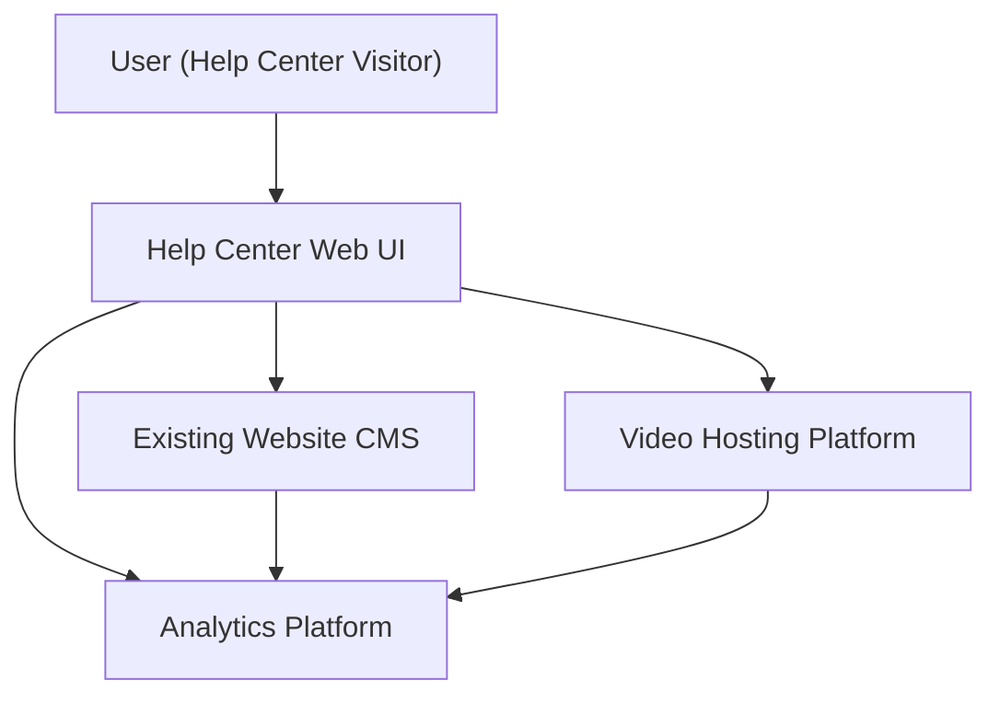

#### 1. High-Level Design
- Summary: Build a comprehensive Help Center content experience with categorized articles, FAQs, videos, downloadable materials, and robust search/filtering to enable users to self-serve for onboarding, troubleshooting, and ongoing product use.

- Component Flow:

- Integration Points:
  - Existing website CMS for storing and serving text articles, FAQs, and downloadable materials.
  - Video hosting platform for embedded tutorial playback.
  - Analytics platforms for tracking Help Center usage, content performance, search behavior, and feedback.
  - Optional integration with personalization/recommendation services if used for personalized content suggestions.

- Key Assumptions:
  - All help content (articles, FAQs, PDFs) is managed through the existing CMS with standard publishing workflows and metadata for categories and types.
  - Search and filtering leverage either the existing site search engine or a pre-approved enterprise search component, configured to index Help Center content and metadata.

- NFR Highlights:
  - Page/content load within 2 seconds (broadband) and 4 seconds (mobile); video playback starts within 3 seconds; support up to 100,000 concurrent users; HTTPS for all content delivery; WCAG 2.1 AA compliance; 99.9% uptime; search results within ~2 seconds.

#### 2. Validation Report
- Requirements Coverage: The design addresses categorized content on the landing page, article and FAQ display, in-page video tutorials, downloadable materials, search and filtering by category/type, error messaging for unavailable resources, responsive design, branding alignment, accessibility support, analytics tracking, user feedback mechanisms, and optional personalization/bookmarking. NFRs around performance, concurrency, security (HTTPS), accessibility, uptime, and search response time are explicitly supported by the identified components and integrations.

