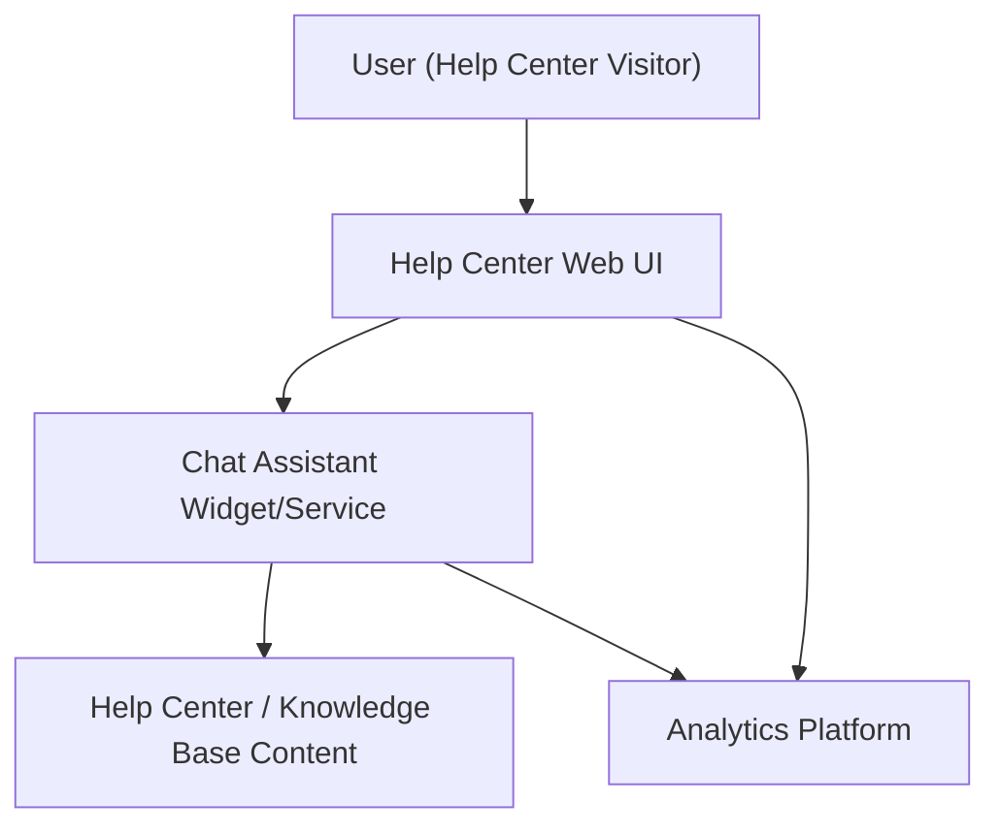

#### 1. High-Level Design
- Summary: Introduce an interactive, automated chat assistant on the Help Center landing page to provide real-time self-service support, surface relevant help materials, and capture analytics on user interactions for continuous content and experience improvements.

- Component Flow:

- Integration Points:
  - Existing website infrastructure for embedding the chat widget.
  - Knowledge base / Help Center content source used to power chat responses.
  - Analytics systems for tracking chat usage and outcomes.
  - Security and privacy controls within the web platform (HTTPS, data protection).

- Key Assumptions:
  - Chat assistant platform is a managed SaaS or existing enterprise-standard component integrated via JavaScript snippet or SDK.
  - Analytics events (chat initiated, messages, article links clicked) are streamed to an existing enterprise analytics platform using current tagging/telemetry standards.

- NFR Highlights:
  - Chat must open within 2 seconds, support up to 10,000 simultaneous chat sessions; interactions over HTTPS; 99.9% Help Center uptime; WCAG 2.1 AA compliance; acceptable performance for up to 100,000 concurrent users.

#### 2. Validation Report
- Requirements Coverage: The proposed design covers key scope items: chat entry from Help Center landing page, automated responses without human agents, surfacing relevant help materials, error handling for unavailable resources, analytics tracking of interactions, support staff monitoring via analytics, security/privacy safeguards (HTTPS and non-disclosure of sensitive data), and responsive, accessible UI across devices. NFRs for latency, concurrency, security, uptime, and accessibility are explicitly reflected in the architecture and integration points.

