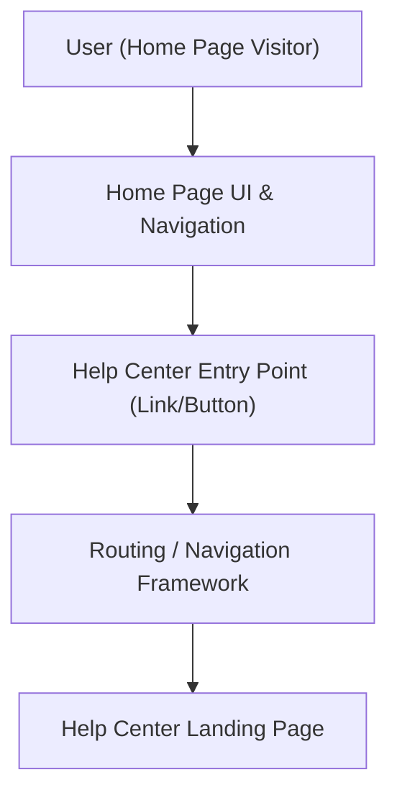

#### 1. High-Level Design
- Summary: Create a prominent, accessible Help Center entry point on the Home Page that navigates users to the Help Center landing page without disrupting existing Home Page layout, behavior, or performance.

- Component Flow:

- Integration Points:
  - Existing website infrastructure and CMS for Home Page content and navigation.
  - Routing/navigation framework handling transitions from Home Page to Help Center.
  - Branding guidelines and design system for visual alignment.
  - Accessibility tooling/audits for WCAG 2.1 AA compliance.

- Key Assumptions:
  - The Help Center landing page URL and routing rules already exist or are provided as part of the overall Help Center implementation.
  - Performance monitoring for the entry point uses existing observability tooling (e.g., RUM/APM) without requiring new platforms.

- NFR Highlights:
  - Help Center landing must open within 2 seconds; components must follow WCAG 2.1 AA; Home Page and Help Center access must maintain 99.9% uptime without regressions to existing features.

#### 2. Validation Report
- Requirements Coverage: The design fulfills a clearly visible and branded entry point in main navigation or a distinct section, seamless navigation to the Help Center landing page, accessibility compliance, regression checks on existing Home Page behavior, and performance validation, all within the stated NFRs and out-of-scope constraints.
