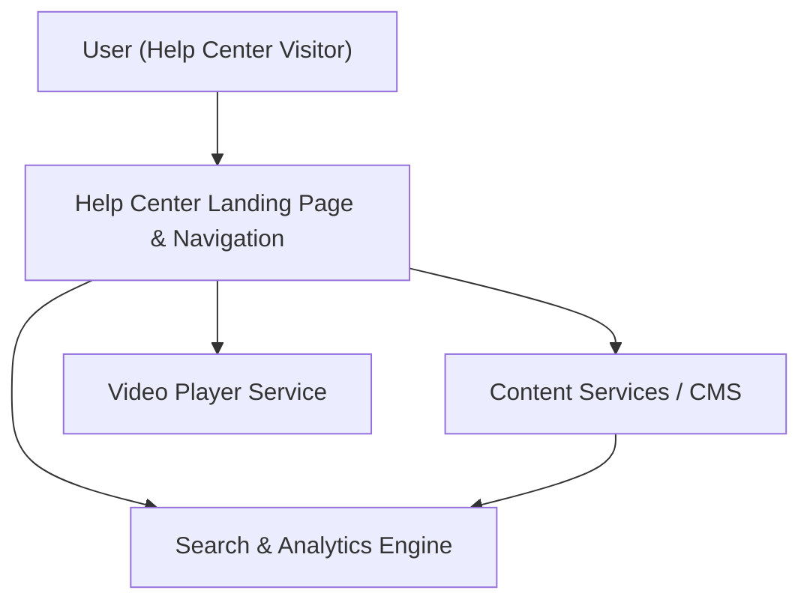

#### 1. High-Level Design
- Summary: Implement a dedicated Help Center landing page with categorized content, articles, FAQs, embedded videos, downloadable materials, and robust search and filtering, including optional feedback, personalization, and bookmarking, all accessible and performant across devices.

- Component Flow:

- Integration Points:
  - Existing website infrastructure and CMS for hosting and managing help content (articles, FAQs, downloads).
  - Video hosting platform for embedded tutorials.
  - Analytics platform for tracking Help Center usage and performance.
  - Editorial team tools/processes for content creation and maintenance.

- Key Assumptions:
  - Search capabilities are built on top of an existing search/analytics platform that can index all Help Center content types (text, video metadata, downloads).
  - Optional features (feedback, personalization, bookmarking) are implemented in a minimal viable way, leveraging existing user identity mechanisms if personalization is enabled.

- NFR Highlights:
  - Help Center landing and content load within 2 seconds on broadband (4 seconds on mobile); video playback within 3 seconds; WCAG 2.1 AA compliance; supports 100,000 concurrent users with 99.9% uptime and robust error handling/fallback.

#### 2. Validation Report
- Requirements Coverage: The design addresses a dedicated landing page, categorized navigation, articles/FAQs, embedded videos, downloads, cross-content search and filtering, error handling, analytics, and optional feedback/personalization/bookmarks while meeting specified performance, scalability, accessibility, and uptime constraints; backend CMS enhancements and live human chat remain explicitly out of scope.

---
