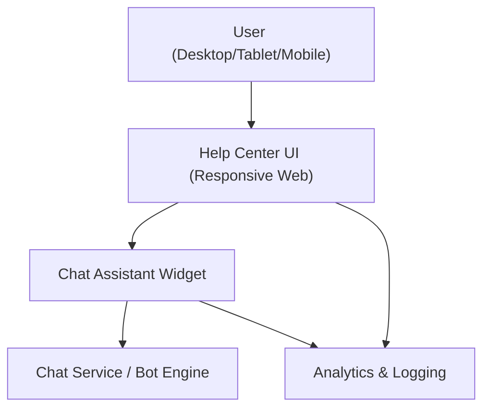

#### 1. High-Level Design
- Summary: Deliver an automated, interactive chat assistant embedded in the Help Center and ensure the entire Help Center (including chat) is fully mobile-responsive, accessible, and secure across desktop, tablet, and mobile devices.

- Component Flow:

- Integration Points:
  - Chat assistant technology integrated into the Help Center (embedded widget / SDK).
  - Existing website infrastructure and CMS for embedding chat and Help Center components.
  - Analytics and logging systems for tracking chat interactions and Help Center usage.
  - Editorial team workflow / knowledge base system for updating chat responses and linked content.
  - Video hosting and download infrastructure for chat-suggested resources.

- Key Assumptions:
  - Chat assistant uses the existing CMS/KB as primary source for knowledge and links to articles/materials.
  - Analytics platform and logging stack already exist and can be extended with new chat and Help Center events without major architectural changes.

- NFR Highlights:
  - Chat window must open within 2 seconds; support up to 10,000 simultaneous chat sessions; all interactions over HTTPS; WCAG 2.1 AA compliance; 99.9% uptime including chat.

#### 2. Validation Report
- Requirements Coverage: The design covers an embedded chat assistant on the Help Center landing page, automated responses with article links, monitoring and analytics, secure HTTPS delivery, WCAG-compliant responsive UI, and high-concurrency/uptime constraints; human live chat and CMS backend enhancements remain out of scope as specified.

---
