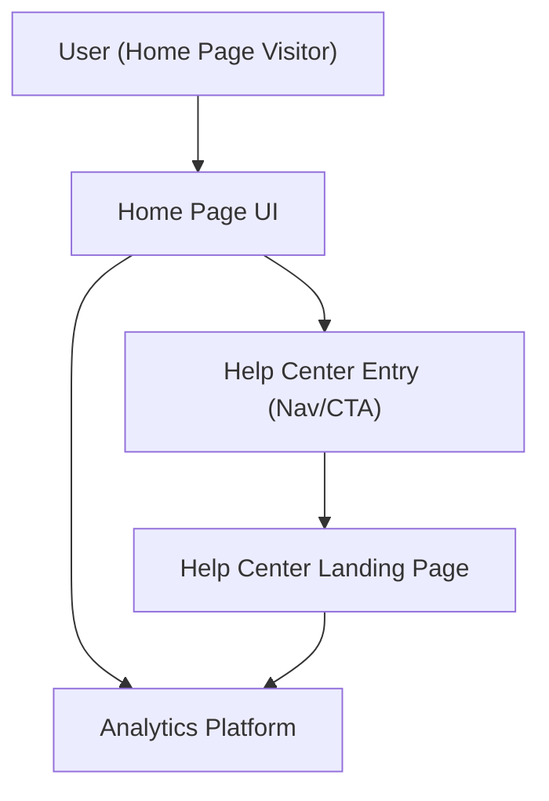

#### 1. High-Level Design
- Summary: Introduce a prominent, accessible Help Center entry point from the Home Page that navigates users to a dedicated Help Center landing experience, preserving existing layout and behavior while enabling analytics on entry usage.
- Component Flow:

- Integration Points:
  - Existing website infrastructure and CMS for navigation and routing between Home Page and Help Center.
  - Branding and design system for consistent visual treatment of the Help Center entry.
  - Analytics platform for tracking Help Center entry usage from the Home Page.
  - Hosting and deployment pipeline for Home Page changes.
- Key Assumptions:
  - The Help Center landing page URL and routing are already available or will be provided as part of the same release train.
  - Existing analytics tagging framework can be extended with minimal changes to capture entry click-through and usage metrics.
- NFR Highlights: Navigation from Home Page to Help Center within 2 seconds, no degradation of Home Page performance, WCAG 2.1 AA compliance, 99.9% Help Center uptime, and all traffic over HTTPS.

#### 2. Validation Report
- Requirements Coverage: The design addresses a visible Help Center entry in navigation or a dedicated section, preserves existing Home Page behavior, enforces branding and accessibility, and enables usage measurement; it fits within the defined scope and NFRs while explicitly avoiding redesigning other Home Page content or introducing live chat or new third-party integrations.
