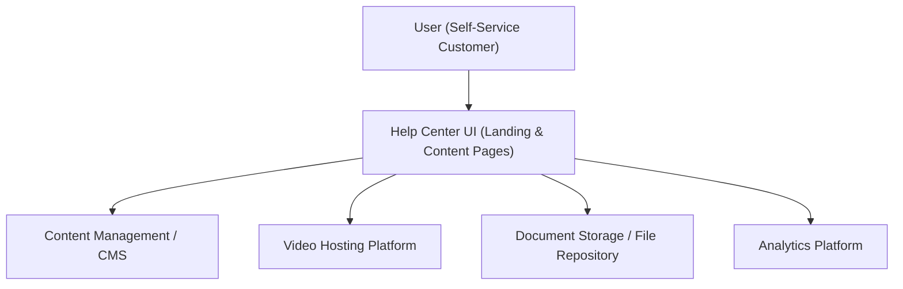

#### 1. High-Level Design
- Summary: Build a dedicated Help Center landing and content experience that allows users to browse, search, and consume categorized help content (articles, FAQs, videos, downloads) with responsive, accessible UI and analytics tracking of user behavior.
- Component Flow:

- Integration Points:
  - Existing website infrastructure and CMS for hosting/serving help content.
  - Video hosting platform for embedded tutorials.
  - File storage/document repository for downloadable materials.
  - Analytics tools for tracking content usage and search behavior.
  - Design system and branding guidelines for consistent look and feel.
  - Error logging and monitoring systems for reliability/performance visibility.
- Key Assumptions:
  - Search is implemented on top of existing CMS/indexing capabilities without requiring new backend CMS features.
  - Analytics events for searches and content interactions reuse the current analytics stack and tagging approach.
- NFR Highlights: Supports up to 100,000 concurrent users with 99.9% uptime, page and content load within 2–4 seconds, videos playable within 3 seconds, secure HTTPS downloads, WCAG 2.1 AA compliance, and search interactions responding within 2 seconds.

#### 2. Validation Report
- Requirements Coverage: The design covers a dedicated Help Center landing page, categorized content browsing, embedded videos, secure downloads, search and filter capabilities, responsive and accessible UI, and analytics tracking; it respects out-of-scope items like CMS backend feature changes and live chat while meeting the epic’s NFRs.

---
