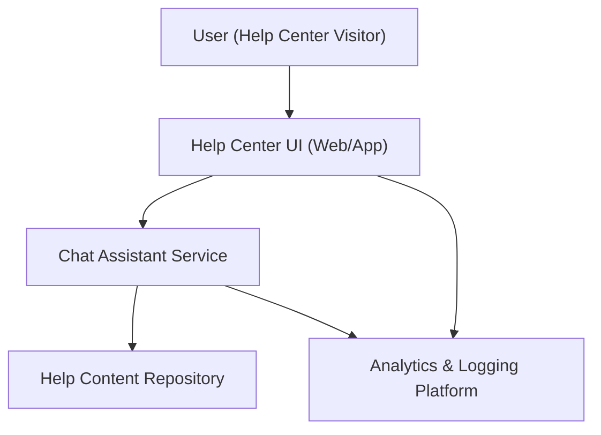

#### 1. High-Level Design
- Summary: Deliver an embedded interactive chat assistant within the Help Center plus supporting analytics to monitor, understand, and optimize self-service support, including secure, scalable chat sessions and insight into user interactions and content effectiveness.
- Component Flow:

- Integration Points:
  - Chat assistant technology platform integrated into the Help Center UI.
  - Help Center content systems (articles, videos, documents) for linking from chat.
  - Analytics and logging platforms to capture Help Center and chat interactions.
  - Existing website infrastructure and deployment pipeline.
- Key Assumptions:
  - Chat assistant platform exposes secure APIs/SDKs that can be embedded into the existing Help Center front end.
  - Analytics events for chat and Help Center interactions are sent in a consistent JSON format aligning with existing logging standards.
- NFR Highlights: Chat over HTTPS with 99.9% uptime, support for up to 10,000 simultaneous chat sessions, chat window open within 2 seconds, WCAG 2.1 AA compliance, and minimal performance impact from analytics.

#### 2. Validation Report
- Requirements Coverage: The design covers embedded chat in the Help Center, secure scalable sessions, linking to existing help content, and analytics capture via an integrated analytics platform; it aligns with the epic’s stated scope and NFRs without adding out-of-scope live human chat or external CRM integrations.

---
