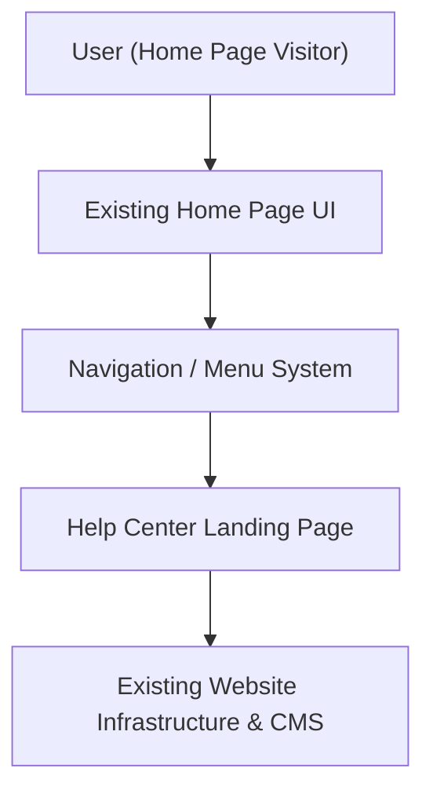

#### 1. High-Level Design
- Summary: Provide a clearly visible, non-disruptive entry point from the Home Page into a dedicated Help Center landing page, ensuring consistent branding, accessibility, secure navigation, and performance without altering existing Home Page functionality beyond what is required for the entry point.
- Component Flow:

- Integration Points:
  - Existing Home Page layout and navigation framework.
  - Existing website infrastructure and CMS supporting the Help Center landing page.
- Key Assumptions:
  - The Help Center landing page is hosted within the same domain and routing framework as the Home Page.
  - Navigation changes (menu item, section link) are configured through existing navigation configuration mechanisms rather than custom code per locale/site.
- NFR Highlights: Landing page load within 2 seconds (4 seconds on mobile), HTTPS for entry and navigation, support for up to 100,000 concurrent users, WCAG 2.1 AA navigation, 99.9% availability.

#### 2. Validation Report
- Requirements Coverage: The design covers creation of a prominent yet non-disruptive Help Center entry point, navigation from Home Page to Help Center landing page, integration with existing Home Page layout and CMS infrastructure, branding and accessibility compliance, and adherence to the specified performance, scalability, security, and availability constraints.

---
