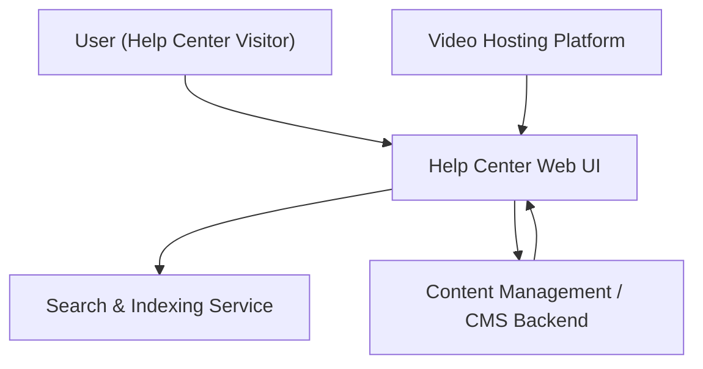

#### 1. High-Level Design
- Summary: Deliver a Help Center experience that offers categorized articles, FAQs, video tutorials, downloadable resources, and robust keyword-based search with filtering, ensuring responsive layouts, branding alignment, accessibility, secure delivery, and clear error/alternative messaging.
- Component Flow:

- Integration Points:
  - Existing website infrastructure and CMS for storing and serving help content.
  - Video hosting platform for embedded tutorials.
  - Existing branding and design system for visual alignment.
- Key Assumptions:
  - Search indexes are built from CMS content and refreshed on a scheduled cadence (e.g., hourly or daily).
  - Downloadable assets (PDFs, guides) are stored and served from a secure, centralized file repository integrated with the CMS.
- NFR Highlights: Pages load within 2 seconds (4 seconds on mobile), videos start within 3 seconds, HTTPS for downloads, support for up to 100,000 concurrent users, WCAG 2.1 AA accessibility, 99.9% uptime.

#### 2. Validation Report
- Requirements Coverage: The design covers categorized landing page content, inline articles and FAQs, embedded videos, secure downloadable resources, keyword search, filtering by category or content type, responsive layouts, branding alignment, accessible content presentation, and error/alternative messaging, as well as the specified performance, scalability, security, and uptime requirements.

---
