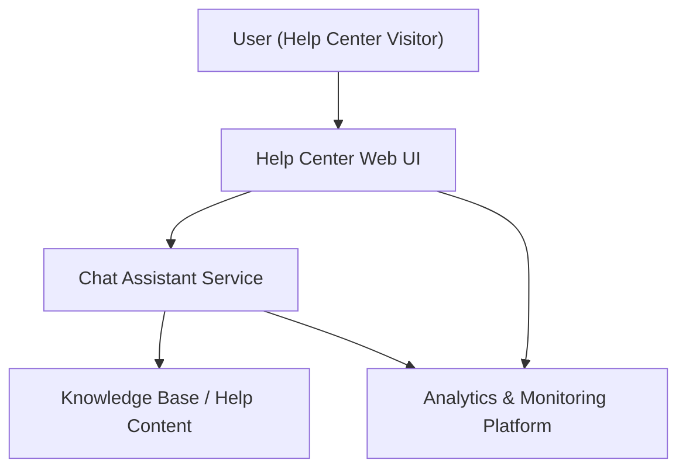

#### 1. High-Level Design
- Summary: Implement an interactive chat assistant on the Help Center landing page that provides automated real-time support, surfaces relevant help resources, and feeds analytics so support staff can monitor interactions and improve content, within defined security, scalability, and accessibility constraints.
- Component Flow:  

- Integration Points:
  - Existing website infrastructure for embedding and hosting the chat component.
  - Chat assistant technology platform.
  - Analytics systems for tracking Help Center and chat usage.
  - Editorial/support tools for maintaining the chat knowledge base and monitoring interactions.
- Key Assumptions:
  - Chat assistant exchanges structured JSON payloads with backend/analytics systems.
  - Analytics events are streamed near real-time (within minutes) to the analytics platform for monitoring.
- NFR Highlights: Chat over HTTPS, up to 10,000 concurrent chat sessions, chat window opens in ~2 seconds, 99.9% uptime, WCAG 2.1 AA compliant behavior.

#### 2. Validation Report
- Requirements Coverage: The design covers an embedded chat assistant on the Help Center landing page, automated responses, linking to relevant articles, analytics tracking of Help Center and chat interactions, monitoring capabilities for support staff, and addresses security, scalability, uptime, and accessibility constraints described in the epic.

---
