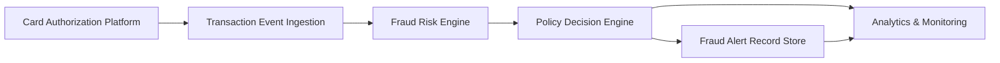

#### 1. High-Level Design

**Summary:** This epic establishes a real-time fraud detection system that ingests credit card transaction events, evaluates them against a fraud-risk engine, and makes policy-driven decisions (approve, alert, step-up, hold, decline). The system creates canonical fraud-alert records, manages alert lifecycle states, and ensures reliable operation with fail-safe/fail-open behavior when components are unavailable.

**Component Flow:**

**Integration Points:**
- **Upstream:** Card authorization and transaction platform (source of transaction events)
- **Core:** Fraud-risk engine and models (risk scoring service)
- **Core:** Policy and decision engine (business rules and threshold configuration)
- **Downstream:** Analytics, monitoring, and audit infrastructure (observability and compliance)
- **Stakeholders:** Security, legal, compliance, and customer-support teams (policy definition and oversight)

**Key Assumptions:**
- Transaction events arrive in a standard format (JSON/Avro) with required fields (amount, merchant, timestamp, card identifier, location) via event streaming platform (e.g., Kafka).
- Fraud-risk engine exposes a synchronous or near-synchronous API returning risk scores within the transaction-time SLA; model versioning and A/B testing are managed externally.

**NFR Highlights:** Risk evaluation must meet agreed transaction-time SLA (likely <200ms); high availability and disaster recovery required; encryption in transit and at rest with least-privilege access; system must handle transaction spikes without unacceptable alert delays.

**Data Flow:**
1. **Input:** Transaction authorization events flow from the card authorization platform to the transaction event ingestion layer in real-time.
2. **Processing:** The ingestion layer deduplicates events (idempotency), then forwards each transaction to the fraud-risk engine for scoring. The risk engine returns a risk score and signals.
3. **Decision:** The policy decision engine evaluates the risk score against configurable thresholds and business rules, determining the action (approve, alert, step-up, hold, decline).
4. **Output:** If an alert is warranted, a canonical fraud-alert record is created in the alert store with initial state (e.g., "Created"). Decision outcomes, risk scores, and alert metadata are sent to analytics and monitoring systems for operational visibility and model performance tracking.

#### 2. Validation Report

**Requirements Coverage:** The design addresses all core requirements in the epic scope:
- Transaction event ingestion from authorization platform ✓
- Risk scoring via fraud-risk engine ✓
- Configurable alert thresholds and risk bands ✓
- Policy engine mapping risk to actions ✓
- Canonical fraud-alert record creation and state model ✓
- Fail-safe/fail-open behavior for unavailable components ✓
- Idempotency for duplicate transaction events ✓
- Analytics events and success metrics ✓
- Model performance monitoring ✓

The architecture supports the NFRs (low-latency SLA, high availability, encryption, observability) and integrates with all identified dependencies. Edge cases (duplicates, risk engine failures) are handled through idempotency and fail-safe logic.

**Gap Analysis:** None identified. The design covers the stated scope and provides clear integration points for upstream transaction sources, the fraud-risk engine, policy configuration, and downstream analytics. Out-of-scope items (enterprise fraud platform, advanced ML model development, cross-product fraud, international regulatory workflows) are appropriately excluded.

**Recommendations:**
1. Define explicit SLA targets (e.g., P95 latency <200ms for risk evaluation) and implement circuit breakers for the fraud-risk engine to enforce fail-open behavior.
2. Establish alert threshold configuration as code with version control and approval workflows to ensure auditability and safe rollout of policy changes.
3. Implement comprehensive observability (metrics, logs, distributed traces) from ingestion through decision to enable rapid troubleshooting and model drift detection.

---

**End of Report**