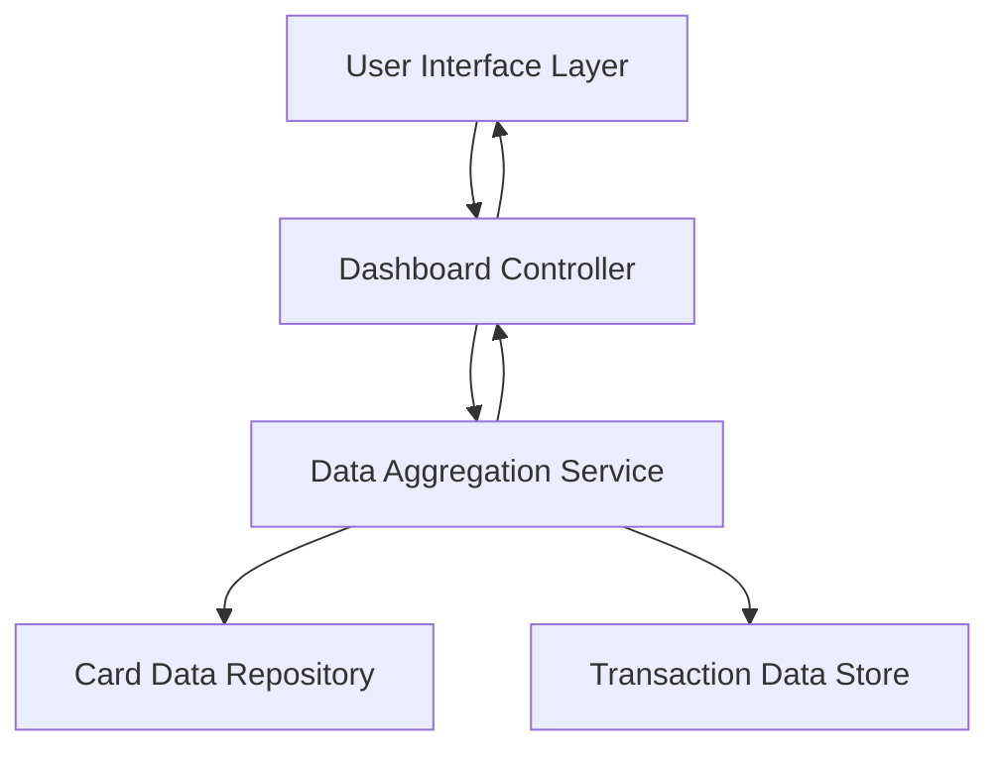

#### 1. High-Level Design

- **Summary**: This epic delivers a modern, responsive dashboard that consolidates all credit cards into a single interface, displaying key financial indicators including monthly spend, total credit limit, available credit, and outstanding amounts. The dashboard must support users with one or multiple cards and provide near real-time KPI updates with responsive layouts across desktop, tablet, and mobile devices.

- **Component Flow**:

- **Integration Points**: 
  - Internal card data repositories or services providing card-level limits, balances, and identifiers
  - Pre-aggregated datasets representing card details and transactions
  - UI framework or component library for responsive layouts and data visualizations
  - Authentication and authorization mechanisms of the host environment

- **Key Assumptions**: 
  - Card and transaction data is available through internal APIs with acceptable latency for near real-time updates
  - Data aggregation occurs server-side or through a dedicated service layer before presentation to the UI

- **NFR Highlights**: Near real-time refresh of dashboard KPIs; responsive layout across desktop, tablet, and mobile; acceptable rendering performance as number of cards increases; visual components maintain readability at scale

- **Data Flow**: User accesses the dashboard through the UI layer, which requests consolidated KPI data from the Dashboard Controller. The Controller invokes the Data Aggregation Service, which queries the Card Data Repository for card limits and balances, and the Transaction Data Store for spending data. The Aggregation Service calculates monthly spend, total credit limit, available credit, and outstanding amounts, then returns the consolidated KPIs to the Controller. The Controller formats and delivers the data to the UI layer, which renders the responsive dashboard with all KPIs displayed for single or multiple cards.

#### 2. Validation Report

- **Requirements Coverage**: The design fully covers the epic's stated scope including responsive dashboard layout, display of multiple credit cards, and all four KPIs (monthly spend, total credit limit, available credit, outstanding amount). The component architecture supports the consolidated view requirement and addresses the NFRs for near real-time updates, responsive layouts, and performance at scale. Integration points align with the stated dependencies on internal data sources and UI frameworks. The design accommodates users with one or multiple cards as specified.