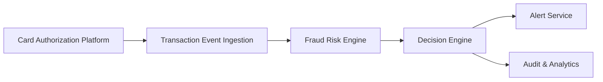

#### 1. High-Level Design

**Summary:** This epic establishes the core fraud detection pipeline that ingests card transaction events, evaluates them through a fraud-risk engine, and produces risk-based decisions (approve, monitor, alert, step up, hold, decline) to minimize fraud losses while preserving legitimate transaction flow.

**Component Flow:**

**Integration Points:**
- **Upstream:** Card authorization/transaction platform (supplies transaction events)
- **Core:** Fraud-risk engine/model (provides risk scores and decisions), Policy/decision engine (maps risk to actions)
- **Downstream:** Alert service (receives fraud-alert records), Audit services (durable logging), Analytics and monitoring infrastructure (model performance tracking)
- **Governance:** Security and compliance stakeholders (define thresholds, policies, retention)

**Key Assumptions:**
- Transaction events arrive in a standardized format (e.g., JSON over Kafka/REST) with required fields (card ID, amount, merchant, timestamp, location).
- Fraud-risk engine is available as a synchronous or near-synchronous API with sub-second response time; fail-safe policies apply during outages.

**NFR Highlights:** Risk evaluation and alert triggering must meet agreed transaction-time SLA; high availability with disaster recovery; idempotency, retries, event versioning, and durable audit; support transaction spikes; strong encryption, authentication, authorization, least privilege; comprehensive observability with metrics, logs, traces, and dashboards.

**Data Flow:** 
1. Card authorization platform emits transaction events containing card ID, amount, merchant, timestamp, and location.
2. Transaction event ingestion layer validates, deduplicates (idempotency), and forwards events to the fraud-risk engine.
3. Fraud-risk engine scores each transaction and returns a risk decision (low/medium/high/confirmed fraud).
4. Decision engine applies configurable thresholds and business rules to map risk scores to actions (approve, alert, decline).
5. For alert-worthy transactions, a canonical fraud-alert record is created and sent to the alert service.
6. All decisions, scores, and events are logged to audit services and analytics infrastructure for compliance, monitoring, and model-drift detection.

#### 2. Validation Report

**Requirements Coverage:** The design addresses all in-scope requirements: transaction ingestion, risk scoring, decisioning with configurable thresholds, fail-safe policies, canonical alert record creation, edge-case handling (retries, duplicates), API/data model definitions, and operational metrics. All stated NFRs (SLA, availability, idempotency, security, observability) are incorporated into the architecture.

**Traceability:**
- Transaction event ingestion → Component B (Transaction Event Ingestion)
- Risk scoring → Component C (Fraud Risk Engine)
- Risk decisioning and mapping → Component D (Decision Engine)
- Alert record creation → Component E (Alert Service)
- Audit and metrics → Component F (Audit & Analytics)
- Fail-safe/fail-open policies → Decision Engine logic with fallback rules
- Edge-case handling (retries, duplicates) → Ingestion layer idempotency and retry logic
- API/data model definitions → Contract definitions between components
- Operational metrics → Analytics infrastructure integration

**Gap Analysis:** No critical gaps identified. All functional and non-functional requirements from the epic are covered by the proposed components and data flow. Integration points with upstream (card platform) and downstream (alert service, audit) systems are clearly defined.

**Compliance & Security Validation:**
- **Encryption:** Sensitive data encrypted in transit (TLS) and at rest (approved encryption standards).
- **Authentication & Authorization:** All inter-service communication uses strong authentication; least-privilege access controls enforced.
- **Audit Trail:** Durable, tamper-evident audit records for all decisions and events, meeting compliance retention policies.
- **Rate Limiting & Abuse Prevention:** APIs protected with rate limiting and idempotency to prevent replay attacks.
- **Observability:** Comprehensive metrics, logs, and traces for model performance, drift detection, and SLA monitoring.

**Risk & Mitigation:**
- **Risk:** Fraud-risk engine unavailability could block transaction decisioning.  
  **Mitigation:** Fail-safe/fail-open policies defined; decision engine applies default rules (e.g., allow low-value transactions, alert high-value) when risk engine is down.
  
- **Risk:** Transaction spikes could overwhelm ingestion or decisioning layers.  
  **Mitigation:** Architecture designed for horizontal scalability; auto-scaling policies and load testing validate capacity under peak load.
  
- **Risk:** Model drift could degrade fraud detection accuracy over time.  
  **Mitigation:** Analytics infrastructure monitors model performance and drift indicators; alerting triggers model retraining or threshold adjustments.

**Test Strategy:**
- **Unit Tests:** Validate decision logic, threshold application, and edge-case handling (duplicates, retries, missing fields).
- **Integration Tests:** Verify end-to-end flow from transaction ingestion through risk scoring to alert creation and audit logging.
- **Performance Tests:** Load testing to confirm SLA compliance under expected and peak transaction volumes.
- **Failover Tests:** Simulate fraud-risk engine outages to validate fail-safe policies and graceful degradation.
- **Security Tests:** Penetration testing on APIs; validation of encryption, authentication, and authorization controls.

**Acceptance Criteria:**
- Transaction events are ingested, deduplicated, and evaluated within the agreed SLA (e.g., <500ms from event to decision).
- Risk scores and decisions are correctly mapped to actions per configurable thresholds and business rules.
- Canonical fraud-alert records are created for alert-worthy transactions and successfully delivered to the alert service.
- Fail-safe policies activate when the fraud-risk engine is unavailable, allowing business continuity.
- All decisions and events are logged to audit services with tamper-evident records.
- Operational dashboards display real-time metrics for detection performance, model drift, and system health.
- System handles transaction spikes (e.g., 3x normal volume) without breaching SLA or availability targets.
- Security controls (encryption, authentication, authorization, rate limiting) pass penetration testing and compliance review.
