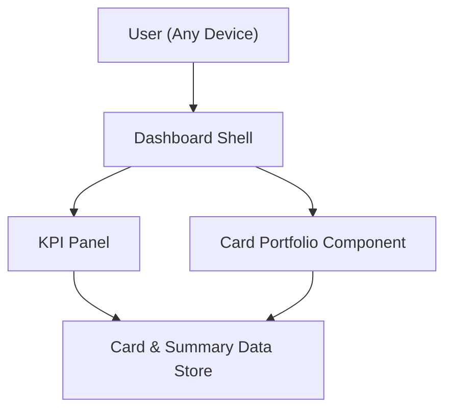

#### 1. High-Level Design
- Summary: Deliver a unified, responsive dashboard that aggregates all user credit cards into a single portfolio view, surfacing KPIs such as monthly spend, total credit limit, available credit, and outstanding amounts across all cards.
- Component Flow:  

- Integration Points:
  - Upstream: Internal or mock data sources representing credit cards, limits, and transaction summaries.
  - Downstream: Front-end framework providing responsive layout and interactive KPI rendering; navigation to detailed card and analytics views.
- Key Assumptions:
  - KPI calculations (monthly spend, limits, available credit, outstanding amounts) are pre-aggregated per user and exposed via a simple API or data layer to the dashboard.
  - Responsive behavior is implemented using the existing front-end framework’s grid/layout system.
- NFR Highlights: Dashboard must render within acceptable time over typical consumer connections, be responsive across common devices, accurately compute KPIs, and handle multiple cards per user without noticeable performance degradation.

#### 2. Validation Report
- Requirements Coverage: The design addresses unified portfolio display, required KPIs, responsive UI, and performance expectations, relying on internal/mock data and front-end frameworks as specified in the epic’s scope and NFRs.
