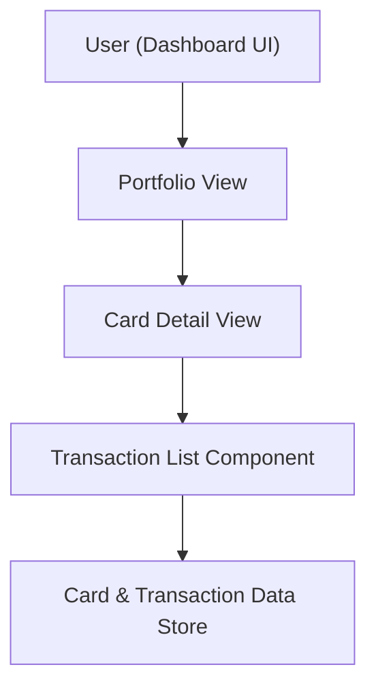

#### 1. High-Level Design
- Summary: Provide detailed card-level and transaction-level views that let users drill down from the overall portfolio into each card’s attributes and associated transactions, supporting better understanding of card usage and balances.
- Component Flow:  

- Integration Points:
  - Upstream: Internal data structures or mock data representing cards and their transaction histories.
  - Downstream: Dashboard navigation shell for linking from portfolio view to card and transaction views.
- Key Assumptions:
  - Sorting and basic filtering are handled on the client for typical card/transaction volumes.
  - Card and transaction datasets are scoped to the same time horizon and data set used by the dashboard KPIs.
- NFR Highlights: Card and transaction views must load within reasonable time for typical volumes, maintaining data consistency with dashboard KPIs and usable UI across different screen sizes.

#### 2. Validation Report
- Requirements Coverage: The design supports card lists, card detail views, transaction association per card, and basic sorting/filtering, and maintains alignment with dashboard KPIs and navigation flows as described in the epic’s scope and NFRs.

---
