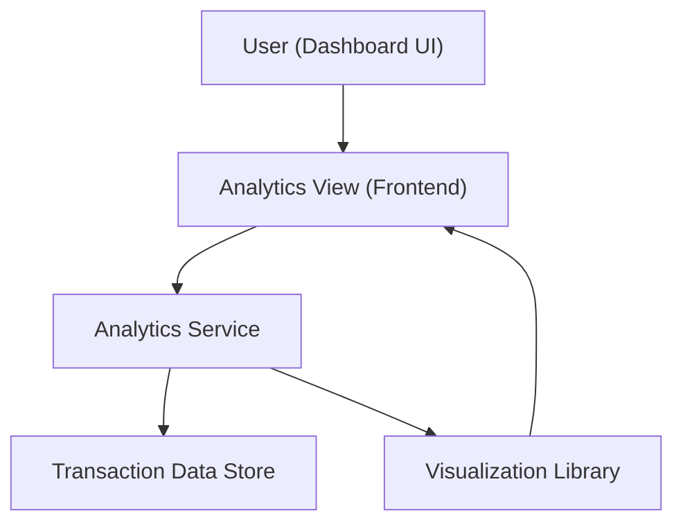

#### 1. High-Level Design
- Summary: Provide interactive analytics that visualize user credit card spending over time, by card, and by category, helping users identify patterns and optimize their spending behavior.
- Component Flow:  

- Integration Points:
  - Upstream: Transaction data structures / transaction data store providing month, card, and category-level transaction records.
  - Downstream: Main dashboard shell for navigation between KPI overview and analytics views; charting/visualization library for interactive charts.
- Key Assumptions:
  - Transaction data is pre-classified into the defined categories (Food & Dining, Fuel, Shopping, etc.) before analytics are rendered.
  - Data retrieval for analytics is batch-based (e.g., per user session) rather than real-time streaming.
- NFR Highlights: Visualizations must remain responsive and interactive for typical user data volumes and be accurate and consistent with underlying transaction data, with acceptable performance on modern browsers/devices.

#### 2. Validation Report
- Requirements Coverage: The design covers core needs for monthly trends, card-wise and category-wise analytics, integrates with transaction data and the dashboard shell, and uses a visualization layer to deliver responsive, interactive charts as described in the epic’s scope and NFRs.

---
