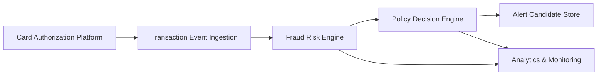

#### 1. High-Level Design

**Summary:** This epic establishes a real-time fraud detection system that ingests credit card transaction events, evaluates risk using a fraud-risk engine, and applies policy-based decisioning to approve, hold, decline, or alert on transactions. The system uses configurable thresholds and business rules to identify suspicious activity while minimizing false positives and maintaining low latency.

**Component Flow:**

**Integration Points:**
- **Upstream:** Card authorization/transaction platform (source of transaction events)
- **Downstream:** Fraud case-management system (for confirmed fraud context), card-management/protection service (for policy alignment), analytics and monitoring infrastructure, audit infrastructure

**Key Assumptions:**
- Transaction events arrive in a standardized format (e.g., JSON/Avro) with required fields (amount, merchant, card ID, timestamp, location)
- Risk scores are returned synchronously or within acceptable latency SLA; fallback behavior (fail-safe/fail-open) is pre-configured per business policy

**NFR Highlights:** Risk evaluation and alert triggering must meet agreed transaction-time latency SLA; high availability with defined disaster recovery; support transaction spikes without unacceptable delays; strong authentication, authorization, encryption, and least privilege access.

**Data Flow:** Transaction events flow from the card authorization platform into the transaction event ingestion layer, which normalizes and validates the data. Events are then passed to the fraud-risk engine for real-time scoring. The risk score and transaction context are sent to the policy decision engine, which applies configurable thresholds and business rules to determine the transaction treatment (approve, alert, hold, decline). Alert candidates are created and stored for downstream processing. Throughout the flow, analytics events are emitted to the monitoring infrastructure for fraud performance tracking, model drift detection, and operational observability.

#### 2. Validation Report

**Requirements Coverage:** The design addresses all core requirements specified in the epic:
- ✅ Transaction event ingestion from authorization platform
- ✅ Risk scoring via fraud-risk engine
- ✅ Configurable risk thresholds and policies
- ✅ Decision mapping to transaction treatment (approve, alert, hold, decline)
- ✅ Alert candidate creation based on risk level
- ✅ Canonical mapping of transactions to fraud-alert records
- ✅ Business rules for fail-safe/fail-open behavior
- ✅ Support for low/medium/high/confirmed-fraud risk bands
- ✅ Configuration of risk thresholds without app release
- ✅ Analytics events for risk and alert decisions
- ✅ Monitoring fraud performance and model drift

The architecture supports all stated NFRs including latency SLA, high availability, idempotency, retries, event versioning, audit trails, security controls, and observability. All identified dependencies (authorization platform, fraud-risk engine, policy engine, analytics infrastructure, security/compliance stakeholders) are accounted for in the integration points. The design explicitly excludes out-of-scope items such as advanced ML model development and complete enterprise fraud-management platform replacement.

**Security & Compliance Validation:**
- Strong authentication and authorization mechanisms required for fraud-related data access
- Encryption in transit and at rest for sensitive data
- Minimal sensitive data exposure with approved retention policies
- Durable audit records for compliance
- Secrets management and least privilege access controls

**Scalability & Performance Validation:**
- System designed to handle transaction spikes without degrading alert generation
- Near-real-time processing with defined latency SLA
- Configurable thresholds enable tuning without deployment
- Observability via metrics, logs, traces, and dashboards for proactive monitoring

**Operational Readiness:**
- Comprehensive monitoring for fraud performance and model drift
- Analytics events capture risk and alert decisions for business intelligence
- Fail-safe/fail-open behavior ensures business continuity during partial outages
- Idempotency and retry mechanisms prevent duplicate processing
