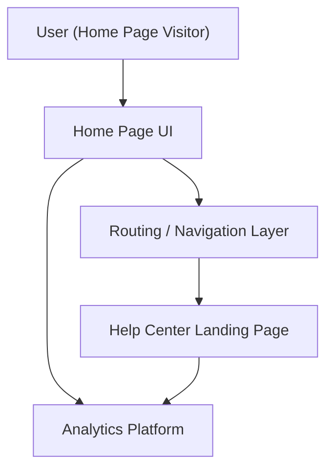

#### 1. High-Level Design
- Summary: Provide a clearly visible, accessible Help Center entry point on the Home Page that routes users to the dedicated Help Center landing page, preserves existing Home Page behavior, and captures entry usage analytics.
- Component Flow:

- Integration Points:
  - Existing website infrastructure and routing for navigation from Home Page to Help Center
  - Existing CMS and navigation configuration for adding the Help Center entry link/section
  - Branding and design system assets for consistent UI
  - Analytics platform for measuring entry point usage
  - Hosting environment and CDN used by the Home Page
- Key Assumptions:
  - Navigation and routing changes can be made via current CMS/navigation tooling without a major Home Page redesign.
  - Analytics tracking for entry point clicks can reuse existing pageview and event tracking mechanisms.
- NFR Highlights: Help Center must open within 2 seconds from Home Page on broadband; integration must not degrade Home Page performance; all traffic uses HTTPS; routing and UI comply with WCAG 2.1 AA; overall Help Center uptime (including entry routing) must be 99.9%; experience must be responsive across devices.

#### 2. Validation Report
- Requirements Coverage: The design accounts for a prominent, branded entry point on the Home Page, routing to a dedicated Help Center, preservation of existing Home Page functionality, responsive behavior, and instrumentation of entry usage. It aligns with all explicitly stated scope items and incorporates the NFRs for performance, security, availability, and accessibility.

---

