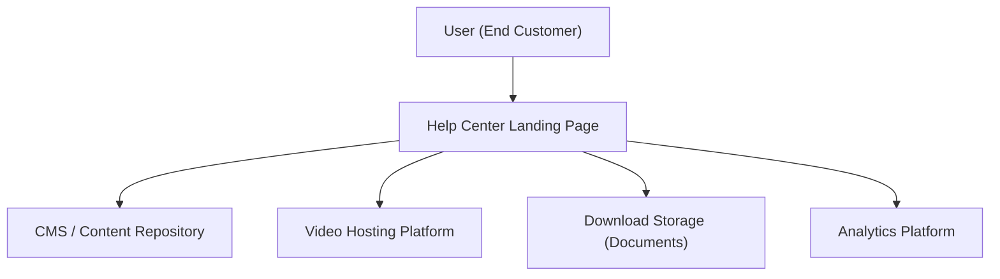

#### 1. High-Level Design
- Summary: Implement a dedicated Help Center landing page that provides categorized, searchable, multi-format content (articles, FAQs, videos, downloads) with robust error handling, responsiveness, accessibility, and analytics to support self-service.
- Component Flow:

- Integration Points:
  - Existing website infrastructure and CMS for hosting and surfacing help content
  - Video hosting platform for tutorials
  - Document storage or file hosting for downloadable materials
  - Analytics tools for tracking content usage and search behavior
  - Brand and design systems for UI components
- Key Assumptions:
  - CMS already exposes APIs or templates to surface categorized content and is not modified beyond configuration and content entry.
  - Video and document hosting endpoints support secure HTTPS delivery and can be embedded or linked via standard URLs.
- NFR Highlights: Landing and core content must load within 2 seconds on broadband (4 seconds on mobile), video playback must start within 3 seconds, downloads must begin within 2 seconds over HTTPS, support up to 100,000 concurrent users, comply with WCAG 2.1 AA, and maintain 99.9% uptime with robust error handling.

#### 2. Validation Report
- Requirements Coverage: The design includes a dedicated landing page, categorized content, multi-format support, keyword search and filters, error handling for unavailable resources, consistent branding, full responsiveness, accessibility, and analytics integration. It directly aligns with the epic’s scope and incorporates the explicit NFRs for performance, concurrency, security, uptime, and accessibility.

---

