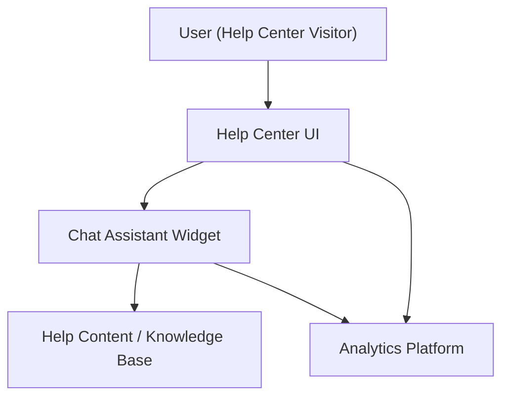

#### 1. High-Level Design
- Summary: Deliver an integrated interactive chat assistant within the Help Center that provides automated support, links users to relevant content, and captures interaction/behavioral data to improve help content and chat responses, while meeting scale, security, and privacy constraints.
- Component Flow:

- Integration Points:
  - Chat assistant technology platform (embedded chat widget in Help Center)
  - Existing website infrastructure for embedding the chat widget
  - Analytics platform for tracking chat interactions and Help Center usage
  - Existing CMS and Help Center content for linking from chat responses
  - Monitoring and logging tools for reliability and performance tracking
- Key Assumptions:
  - Chat assistant platform exposes a JavaScript widget or SDK that can be embedded in the Help Center landing page.
  - Analytics and logging are integrated via existing organizational tools (e.g., existing web analytics and logging stack) using standard event tracking.
- NFR Highlights: Chat must open within 2 seconds, support 10,000 simultaneous sessions, run over HTTPS with no sensitive data exposure, maintain 99.9% availability, comply with WCAG 2.1 AA, and ensure logging/analytics avoid storing sensitive data.

#### 2. Validation Report
- Requirements Coverage: The proposed design covers an embedded chat assistant on the Help Center page, automated flows for common questions, linking to help content, collection of interaction analytics, and use of existing chat, CMS, analytics, and monitoring platforms. It aligns with the epic’s scope and explicitly addresses stated NFRs (performance, scalability, security, availability, and accessibility).

---

