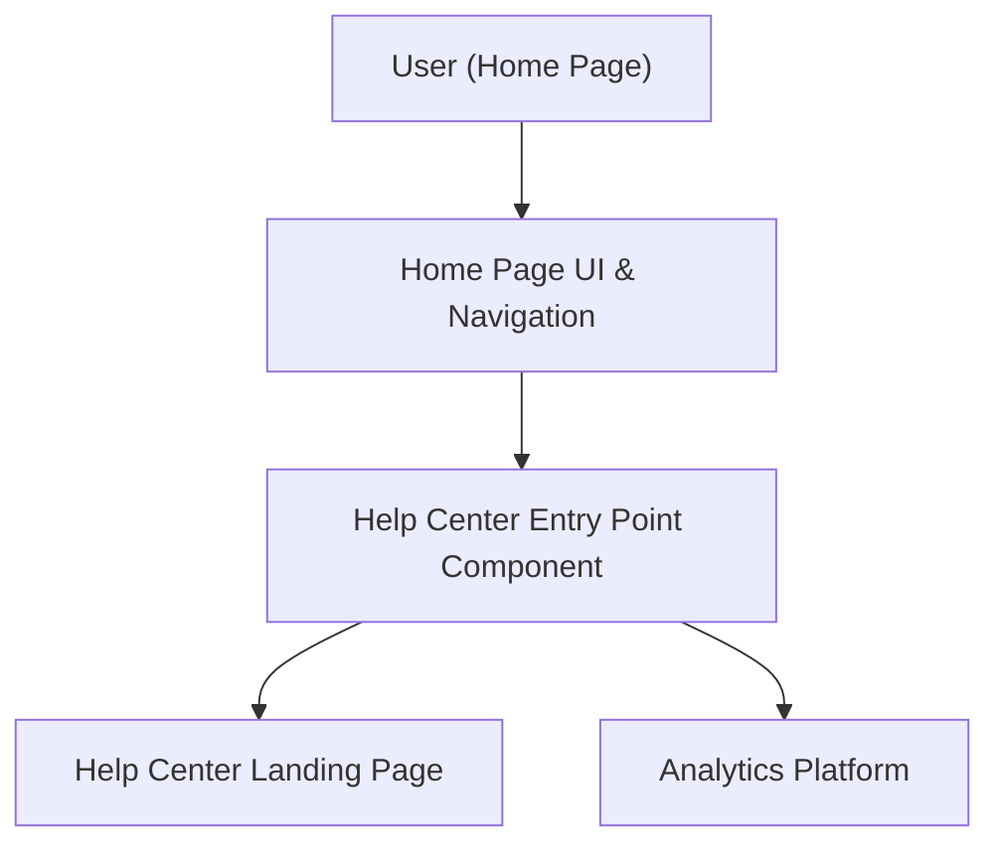

#### 1. High-Level Design
- Summary: Implement a prominent yet non-disruptive Help Center entry point on the Home Page that routes users to the dedicated Help Center landing page while preserving existing layout, ensuring responsive behavior, accessibility, performance, and reliability.
- Component Flow:

- Integration Points:
  - Existing website infrastructure and routing/navigation framework.
  - Existing CMS managing Home Page and navigation.
  - Branding and design system for visual alignment.
  - Accessibility tooling for validating entry point interactions.
  - Analytics systems for tracking entry-point usage and navigation flows.
- Key Assumptions:
  - Navigation and routing layer supports adding a new Help Center link/section without refactoring existing routes.
  - Analytics tagging framework is already in place and can be extended to track Help Center entry clicks and conversion.
- NFR Highlights: Help Center landing page opens within 2 seconds on broadband (4 seconds mobile), navigation reliability aligned to 99.9% uptime, HTTPS-only, WCAG 2.1 AA compliance, and support for 100,000 concurrent users entering via the Home Page without degrading performance.

#### 2. Validation Report
- Requirements Coverage: The design addresses entry point design and placement, navigation and routing to the Help Center, responsive behavior, branding alignment, accessibility validation, performance optimization, and regression safety for existing Home Page features, in line with the epic’s scope and constraints.

---
