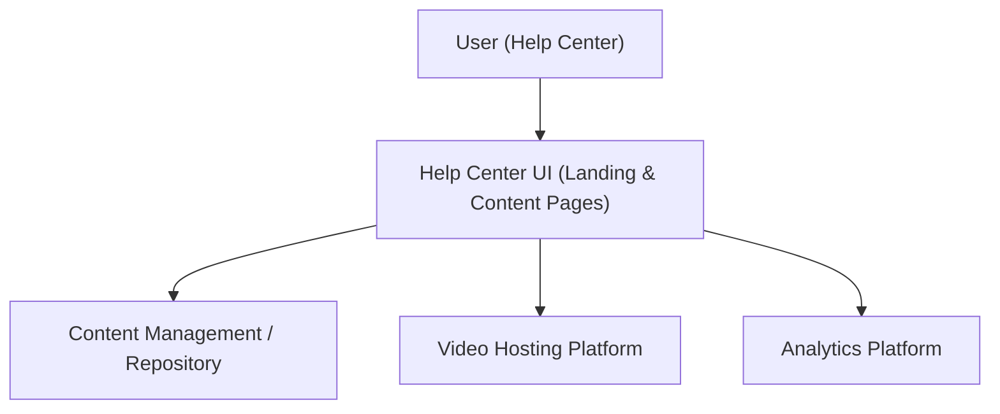

#### 1. High-Level Design
- Summary: Deliver a Help Center content experience that organizes help materials into intuitive categories, supports multiple formats (articles, FAQs, videos, downloads), and provides search, filters, analytics, and optional feedback/personalization while maintaining responsiveness, accessibility, and branding.
- Component Flow:

- Integration Points:
  - Existing website infrastructure and hosting for Help Center pages.
  - Existing CMS/content repository for articles, FAQs, and downloads.
  - Video hosting platform for tutorials.
  - Analytics platform for tracking content usage, search behavior, and interactions.
  - Branding and design system; accessibility auditing tools.
- Key Assumptions:
  - CMS exposes APIs or templates to surface existing content without major backend changes.
  - Analytics platform already ingests page views and can be extended with custom events for search and content interactions.
- NFR Highlights: Pages load within 2 seconds on broadband (4 seconds mobile), videos begin playback within 3 seconds, Help Center scales to 100,000 concurrent users with 99.9% uptime, search responds in ~2 seconds, all over HTTPS with WCAG 2.1 AA compliance.

#### 2. Validation Report
- Requirements Coverage: The design covers landing page layout, categorization, multi-format content support, search and filters, error handling, responsive design, branding alignment, accessibility, analytics tracking, and optional feedback/personalization/bookmarking as specified, without introducing out-of-scope CMS or integration changes.

---
