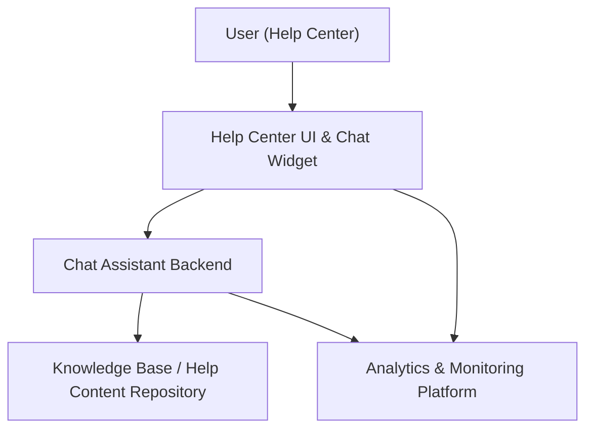

#### 1. High-Level Design
- Summary: Provide an integrated, automated chat assistant on the Help Center landing page, enabling users to initiate chats, receive automated responses and links to relevant help content, while capturing detailed interaction analytics and ensuring security, scalability, and accessibility.
- Component Flow:

- Integration Points:
  - Existing Help Center landing page and site UI.
  - Selected chat assistant technology/platform.
  - Help content repositories (articles, videos, documents).
  - Analytics platform for tracking chat events and Help Center usage.
  - Security and compliance processes for chat data handling.
- Key Assumptions:
  - Chat assistant platform exposes secure APIs/SDKs for UI integration and analytics event streaming.
  - Analytics platform can correlate chat events with Help Center content and ticket systems using shared identifiers.
- NFR Highlights: Supports up to 10,000 simultaneous chat sessions and 100,000 concurrent Help Center users, chat window opens within 2 seconds on broadband (4 seconds mobile), HTTPS-only, 99.9% availability target, WCAG 2.1 AA compliance, and real-time-acceptable latency for chat responses.

#### 2. Validation Report
- Requirements Coverage: The design covers chat launch from the Help Center, automated responses, linking to help content, robust error handling, security and privacy protections, high concurrency support, analytics and dashboards for chat interactions, and accessibility requirements as described in the epic.

---
