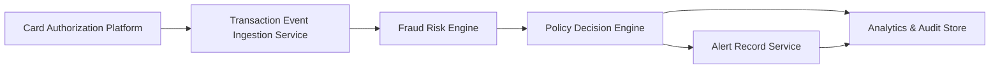

#### 1. High-Level Design

- **Summary**: This epic implements end-to-end risk evaluation and fraud decisioning for credit card transactions. The system ingests authorization events, evaluates fraud risk using a risk engine, applies configurable business rules and thresholds via a policy engine, and determines transaction outcomes (approve, alert, hold, decline). It maintains idempotent, auditable decision trails while minimizing false positives and ensuring near-real-time processing.

- **Component Flow**:

- **Integration Points**: 
  - **Upstream**: Card authorization/transaction platform (source of transaction events)
  - **Downstream**: Fraud-risk engine/model (risk scoring), Policy/decision engine (threshold and rule application), Analytics and monitoring infrastructure (event tracking), Audit infrastructure (compliance logging)

- **Key Assumptions**: 
  - Transaction events arrive in a structured format with sufficient attributes (amount, merchant, timestamp, card identifier) for risk evaluation.
  - The fraud-risk engine provides risk scores in a numeric or categorical format that can be mapped to configurable thresholds.

- **NFR Highlights**: Near-real-time SLA for risk evaluation and alert triggering; high availability with disaster recovery; encryption in transit and at rest; least-privilege access control; support for transaction spikes; durable audit records with approved retention policies.

- **Data Flow**: Transaction authorization events flow from the card platform to the ingestion service, which forwards transaction details to the fraud-risk engine. The risk engine returns a risk score to the policy decision engine, which applies configurable thresholds and business rules to determine the action (approve, alert, hold, decline). For suspicious transactions, a canonical fraud-alert record is created in the Alert Record Service. All decisions and key events are logged to the Analytics & Audit Store for compliance, monitoring, and operational visibility.

#### 2. Validation Report

- **Requirements Coverage**: The design covers all core requirements specified in the epic: transaction event ingestion, risk scoring integration, configurable thresholds and policy mapping, idempotent decision handling, canonical alert record creation, fail-safe behavior, audit trails, and analytics events. The architecture supports the MVP scope (selected card transaction types) and accommodates the NFRs for near-real-time processing, high availability, security, encryption, least-privilege access, and durable audit records. Integration points with the card authorization platform, fraud-risk engine, policy engine, and analytics/audit infrastructure are explicitly addressed. The design ensures that each transaction maps to a single fraud-alert record and handles duplicate events idempotently, meeting the epic's reliability and consistency goals.
