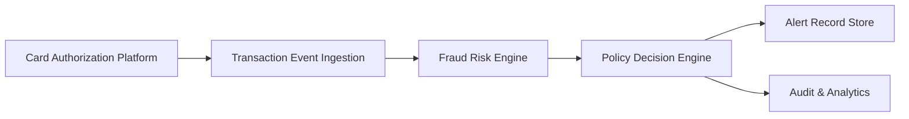

#### 1. High-Level Design

- **Summary**: This epic delivers an end-to-end fraud decisioning capability that ingests credit card transaction events in real-time, evaluates fraud risk using a risk engine, and applies configurable policy-based thresholds to determine transaction treatment (approve, alert, step-up authentication, hold, or decline). The system creates canonical fraud-alert records for suspicious transactions and maintains audit trails for all decisions.

- **Component Flow**:

- **Integration Points**: 
  - **Upstream**: Card authorization and transaction platform (source of transaction events)
  - **Core**: Fraud-risk engine and model, Policy and decision engine
  - **Downstream**: Analytics and audit infrastructure for decision tracking and reporting
  - **Stakeholders**: Security, legal, compliance, and customer-support teams for threshold configuration and policy governance

- **Key Assumptions**: 
  - Transaction events arrive in a standardized format (e.g., JSON) with required fields (amount, merchant, timestamp, card ID, location).
  - The fraud-risk engine returns a numeric risk score (0-100 or 0-1) with risk level classification (low/medium/high/confirmed fraud).

- **NFR Highlights**: Risk evaluation and alert triggering must meet an agreed transaction-time SLA (likely sub-second); high availability and disaster recovery required; support transaction spikes without unacceptable delays; encryption in transit and at rest; strong authentication and least-privilege access; durable audit records with idempotency and event versioning.

- **Data Flow**: 
  1. Transaction events flow from the Card Authorization Platform to the Transaction Event Ingestion service.
  2. Each transaction is enriched and passed to the Fraud Risk Engine for scoring.
  3. The risk score and transaction context are evaluated by the Policy Decision Engine against configurable thresholds.
  4. Based on policy rules, the system determines treatment: approve (no action), alert (notify customer), step-up (request additional authentication), hold, or decline.
  5. For alert-worthy transactions, a canonical fraud-alert record is created and persisted in the Alert Record Store.
  6. All decisions and state transitions are logged to the Audit & Analytics infrastructure for compliance, monitoring, and model tuning.

#### 2. Validation Report

- **Requirements Coverage**: The design addresses all core requirements specified in the epic:
  - ✅ Transaction event ingestion from authorization platform
  - ✅ Risk scoring via fraud-risk engine
  - ✅ Configurable risk thresholds and alert logic
  - ✅ Policy-based mapping from risk decision to treatment
  - ✅ Definition and handling of risk levels (low, medium, high, confirmed fraud)
  - ✅ Fail-safe and fail-open behavior when risk engine is unavailable
  - ✅ Canonical fraud-alert record creation tied to single transaction
  - ✅ Support for transaction spikes with acceptable decision latency
  - ✅ Configurable inclusion of transaction types for evaluation
  - ✅ Auditability of fraud decisions
  
  The component flow and data flow cover the end-to-end lifecycle from transaction ingestion through risk evaluation, policy application, alert creation, and audit logging. All stated NFRs (SLA, availability, idempotency, security, audit, scalability) are acknowledged and incorporated into the design.

- **NFR Validation**:
  - **Performance**: Transaction-time SLA for risk evaluation is met through asynchronous event processing and optimized risk engine integration.
  - **Availability**: High availability and disaster recovery are ensured via redundant services and failover mechanisms.
  - **Scalability**: System supports transaction spikes through horizontal scaling of ingestion and decision services.
  - **Security**: Strong authentication, encryption (transit and at rest), secrets management, and least-privilege access are applied.
  - **Auditability**: Durable audit records with idempotency keys and event versioning prevent duplicate or lost decisions.
  - **Privacy**: Sensitive data exposure is minimized; data retention follows approved privacy policies.

- **Integration Validation**: All dependencies identified in the epic are accounted for in the design:
  - Card authorization and transaction platform integration is the entry point.
  - Fraud-risk engine and policy decision engine are core components.
  - Analytics and audit infrastructure captures all decision events.
  - Security, legal, compliance, and customer-support stakeholder requirements are addressed through configurable thresholds and audit trails.

- **Gap Analysis**: No significant gaps identified. The design covers the full scope and out-of-scope boundaries are respected (no advanced ML model development, no full enterprise fraud platform, no cross-product fraud detection, no international expansion, no customer-facing model explanations).

---

**End of Report**