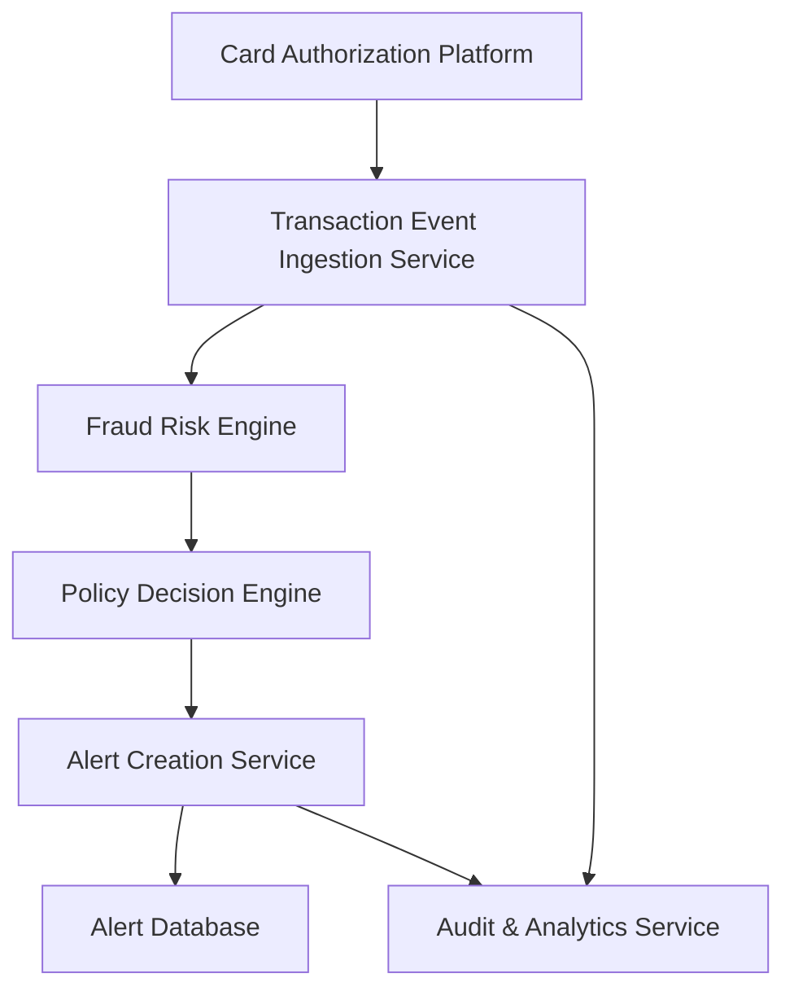

#### 1. High-Level Design

**Summary:** This epic establishes the foundational fraud detection pipeline that ingests credit card transaction events in real-time, evaluates them against a fraud risk engine, applies configurable policy thresholds to determine risk levels, and creates canonical alert records for suspicious transactions. The system must handle high transaction volumes with low latency while maintaining idempotency and audit integrity.

**Component Flow:**

**Integration Points:**
- **Upstream:** Card authorization/transaction platform (publishes transaction events)
- **Downstream:** Fraud-risk engine/model (consumes transaction context, produces risk scores)
- **Downstream:** Policy/decision engine (maps risk scores to actions: approve, monitor, alert, decline)
- **Downstream:** Analytics, monitoring, and audit infrastructure (captures fraud events and metrics)
- **Cross-cutting:** Security, legal, compliance, and customer-support stakeholders (governance and policy input)

**Key Assumptions:**
- Transaction events arrive in a standardized format with required fields (transaction_id, account_id, card_id, merchant, amount, currency, timestamp, channel).
- The fraud-risk engine is owned and maintained by a separate team and exposes a synchronous or near-real-time API for risk scoring.

**NFR Highlights:** Risk evaluation and alert triggering must meet agreed transaction-time SLA; high availability and disaster recovery for security-critical services; support transaction spikes without unacceptable alert delays; strong authentication, encryption, idempotency, and durable audit records.

**Data Flow:**
1. **Input:** Card authorization platform publishes transaction events containing transaction_id, account_id, card_id, merchant, amount, currency, timestamp, and channel.
2. **Processing:** Transaction ingestion service validates and deduplicates events, then forwards eligible transactions to the fraud risk engine. The risk engine evaluates transaction context against fraud models and returns a risk score and risk band (low/medium/high). The policy decision engine applies configurable thresholds to map risk scores to actions (approve, monitor, alert, decline).
3. **Output:** For transactions meeting alert thresholds, the alert creation service generates a canonical fraud-alert record (alert_id, transaction_id, customer_id, severity, status=created, created_at, expires_at) and persists it to the alert database. All decisions and state transitions are logged to the audit and analytics service for operational monitoring and compliance.

#### 2. Validation Report

**Requirements Coverage:**
The design comprehensively covers the epic's stated scope:
- ✅ Transaction event ingestion from authorization platform (FR-01)
- ✅ Risk scoring integration for eligible transactions (FR-02)
- ✅ Configurable risk thresholds and policy decisions (FR-03)
- ✅ Alert candidate creation based on risk decisions (alert creation service)
- ✅ Canonical fraud-alert record per suspicious transaction (FR-10, business rules)
- ✅ Risk-level treatment mapping (low/medium/high/confirmed fraud) via policy engine
- ✅ Alert state lifecycle definition (created → resolved/expired) (FR-09)
- ✅ Idempotent handling of duplicate transaction events (FR-10)
- ✅ Failsafe/fail-open behavior when risk engine unavailable (edge case handling)
- ✅ Audit trail for alert creation and decisioning (FR-09)
- ✅ Analytics events for alert creation and risk decisions (fraud_alert_created event)
- ✅ Success metrics and monitoring for detection performance (fraud loss rate, detection rate, false positive rate)

**NFR Validation:**
- ✅ Latency: Architecture supports near-real-time processing with direct integration between ingestion, risk engine, policy engine, and alert creation
- ✅ Availability: High availability and disaster recovery requirements acknowledged for security-critical services
- ✅ Security: Strong authentication, authorization, encryption, secrets management, and least privilege enforced across all components
- ✅ Reliability: Idempotency, retries, event versioning, and durable audit records built into design
- ✅ Scalability: Architecture supports transaction spikes through event-driven ingestion and stateless processing services
- ✅ Privacy: Data retention policies and minimal sensitive data exposure enforced
- ✅ Observability: Metrics, logs, traces, and operational dashboards provided via audit & analytics service

**Dependency Validation:**
All stated dependencies are addressed in the design:
- ✅ Card authorization/transaction platform (upstream integration point)
- ✅ Fraud-risk engine/model (core risk evaluation component)
- ✅ Policy/decision engine (threshold and action mapping)
- ✅ Analytics, monitoring, and audit infrastructure (audit & analytics service)
- ✅ Security, legal, compliance, and customer-support stakeholders (governance input to policy configuration)

**Edge Cases & Business Rules:**
- ✅ Duplicate transaction events handled via idempotency in ingestion service (FR-10)
- ✅ Risk engine unavailable: failsafe/fail-open policy applied per transaction type (edge case documented in PRD)
- ✅ Single transaction maps to single canonical alert record (business rule enforced by alert creation service)
- ✅ Fraud-alert decisions auditable (FR-09, audit trail component)
- ✅ Risk thresholds configurable without client-app release (policy engine with external configuration)

**Acceptance Criteria Validation:**
The design satisfies all relevant acceptance criteria for this epic:
- ✅ "Given an eligible suspicious transaction, when the risk decision crosses the configured alert threshold, an alert is created" → Policy decision engine triggers alert creation service
- ✅ "Given the same transaction event is received multiple times, duplicate processing does not create unintended duplicate cases" → Idempotency in ingestion service
- ✅ "Given the fraud engine is unavailable, the system follows the predefined transaction-specific fail-safe policy and records the condition" → Failsafe behavior with audit logging
- ✅ "Given any alert lifecycle transition, the relevant audit record is retained" → Audit & analytics service captures all state changes

**Conclusion:**
The high-level design fully addresses the epic's requirements, dependencies, NFRs, and acceptance criteria. The architecture provides a clear, scalable, and secure foundation for real-time fraud risk evaluation and alert creation, with appropriate integration points, failover mechanisms, and observability. No gaps identified.