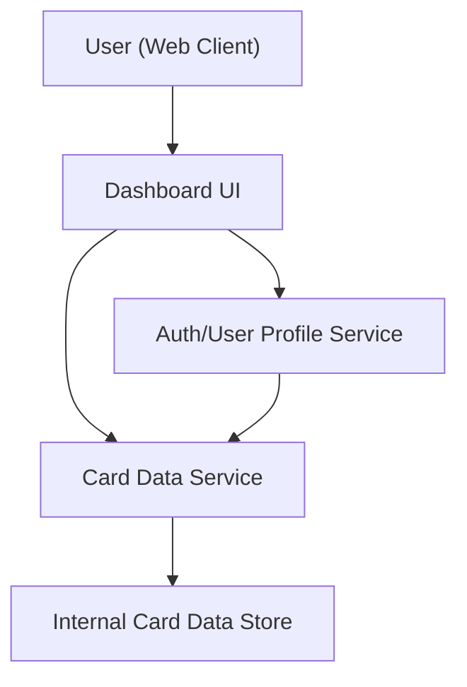

#### 1. High-Level Design
- Summary: Build a modern, responsive dashboard that consolidates all of a user’s credit cards into a single interface, presenting KPIs such as monthly spend, total credit limit, available credit, and outstanding amount, with support for viewing and switching between multiple cards.
- Component Flow:

- Integration Points: Internal card data store for card details, limits, available credit, and outstanding amounts; authentication/user profile service to associate cards with the correct user account.
- Key Assumptions: Card data store exposes read-only APIs for card metadata and financial KPIs; user authentication/session is handled before dashboard access and provides a unique user identifier for card association.
- NFR Highlights: Responsive layouts across common device sizes; dashboard views should load within acceptable user experience thresholds on typical consumer connections; data must be consistent and accurate for all cards displayed.

#### 2. Validation Report
- Requirements Coverage: The design supports a unified, multi-card dashboard with the required KPIs, responsive UI, and integration to internal data and auth/profile services, aligning with the epic’s stated scope and exclusions (no real bank integration or payment capabilities).
