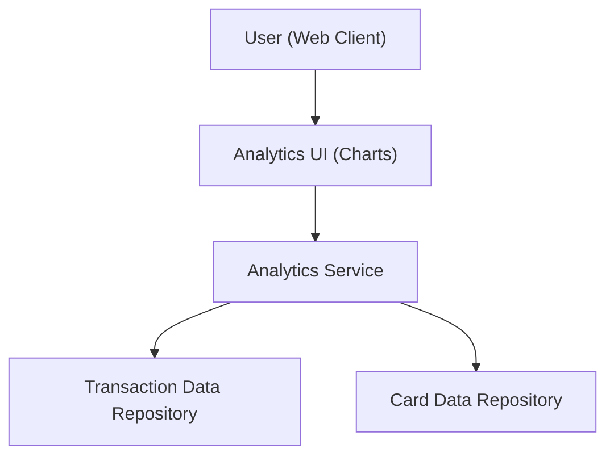

#### 1. High-Level Design
- Summary: Provide analytical views of spending over time and per card, including monthly spend trends, card-wise spend analysis, interactive charts, card filters, and consolidated monthly spending metrics that feed into KPI views.
- Component Flow:

- Integration Points: Transaction data repository for spend history; card data repository to map transactions to specific cards; visualization/charting library used by the Analytics UI to render interactive charts.
- Key Assumptions: Transaction data includes card identifiers and timestamps sufficient for monthly and per-card aggregation; charting library is client-side and consumes pre-aggregated metrics from the analytics service.
- NFR Highlights: Charts and visualizations must render smoothly in modern browsers, handle typical consumer transaction volumes without noticeable lag, and ensure accurate aggregation of monthly and card-wise spend figures.

#### 2. Validation Report
- Requirements Coverage: The design covers monthly trend visualization, card-wise analysis, interactive charts, card filtering, and consolidated KPIs by leveraging transaction/card repositories and a charting UI, meeting the epic’s functional scope and performance/accuracy NFRs.
