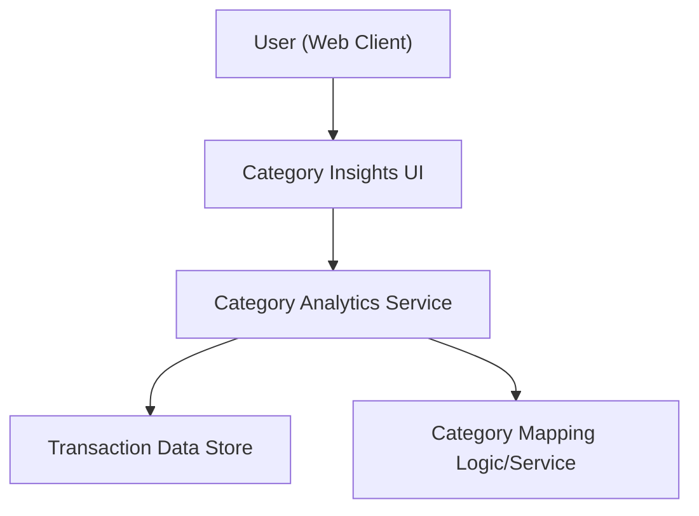

#### 1. High-Level Design
- Summary: Deliver category-wise spending insights by grouping transactions into predefined categories (Food & Dining, Fuel, Shopping, Travel, Entertainment, Utilities, Healthcare, Education, Miscellaneous) and presenting interactive visualizations of spending distribution across these categories and cards.
- Component Flow:

- Integration Points: Transaction data store providing detailed transaction records; category mapping logic/service that assigns each transaction to one of the predefined categories; visualization libraries used in the UI to render interactive category charts.
- Key Assumptions: Each transaction can be deterministically mapped to exactly one of the predefined categories; the category mapping rules are centrally managed and consistent across all cards and transactions.
- NFR Highlights: Category-wise charts must remain responsive and usable across devices, handle typical transaction volumes with acceptable load times, and ensure reliable, consistently applied category calculations.

#### 2. Validation Report
- Requirements Coverage: The design supports category-wise visualization, predefined category mappings, interactive chart exploration, and cross-card category insights, while adhering to responsiveness, performance, and calculation consistency requirements stated in the epic.
