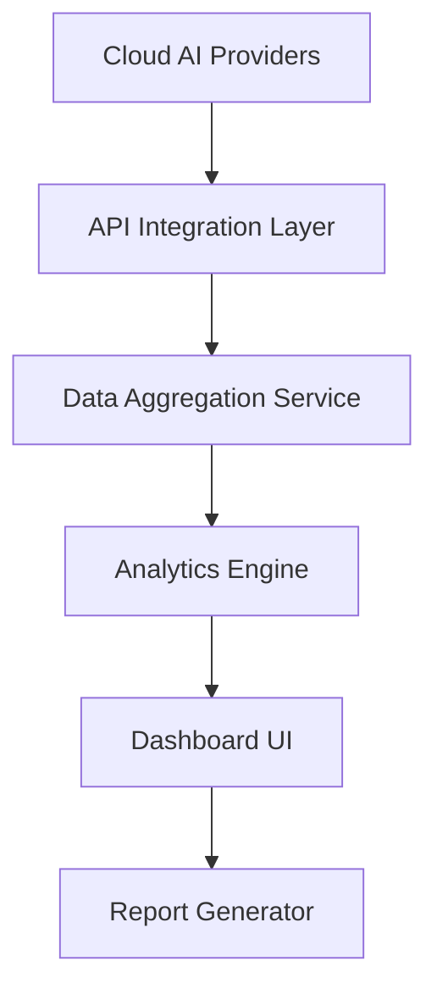

#### 1. High-Level Design

- **Summary**: This epic delivers a centralized, real-time dashboard that aggregates AI usage and spend data from AWS, Azure, and GCP across all portfolio companies. It provides portfolio-wide visibility, benchmarking, drill-down analytics, and reporting capabilities to enable Operating Partners, Deal Partners, and General Partners to monitor AI adoption, identify inefficiencies, track value creation, and reduce operating expenses.

- **Component Flow**:

- **Integration Points**: 
  - **Upstream**: AWS AI services APIs, Azure AI services APIs, GCP AI services APIs for secure data ingestion
  - **Downstream**: SSO provider for authentication, email/notification services for data freshness alerts, internal monitoring services for performance tracking

- **Key Assumptions**: 
  - Portfolio companies have already configured and authorized API access to their cloud AI provider accounts
  - AI usage and spend data from cloud providers follows a standardized schema that can be normalized across AWS, Azure, and GCP

- **NFR Highlights**: Dashboard pages must load within 3 seconds for 95% of interactions with up to 50 portfolio companies; system must support 200 portfolio companies and 1,000 concurrent users; 99.5% uptime with TLS 1.2+ and AES-256 encryption; WCAG 2.1 AA accessibility compliance.

- **Data Flow**: Cloud AI providers expose usage and spend data via secure APIs → API Integration Layer authenticates and fetches data from AWS, Azure, GCP → Data Aggregation Service normalizes and consolidates data across providers and companies → Analytics Engine processes aggregated data to compute benchmarks, trends, and anomalies → Dashboard UI presents real-time visualizations, drill-downs, and data freshness indicators to authenticated users → Report Generator exports data to PDF/Excel formats for stakeholder meetings.

#### 2. Validation Report

- **Requirements Coverage**: The design addresses all stated functional requirements including real-time data aggregation from three major cloud providers (FR1, FR2), role-based access control (FR3), data freshness indicators and notifications (FR6), benchmarking and drill-down analytics (FR7, FR9), and report export (FR5). The architecture supports the specified non-functional requirements for performance (3-second load time), scalability (200 companies, 1,000 users), security (encryption, RBAC, audit logging), accessibility (WCAG 2.1 AA), and reliability (99.5% uptime). The component flow clearly maps to user stories US1 (consolidated dashboard), US3 (pre/post investment reports), US4 (executive summaries), US7 (drill-down), and US8 (data freshness notifications). Integration points align with stated dependencies on cloud provider APIs and SSO. The design scope excludes out-of-scope items (direct AI model management, on-premise integrations, custom AI development) as specified in the epic.