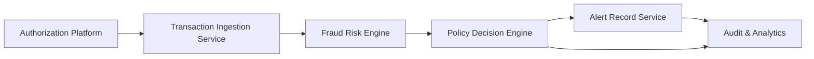

#### 1. High-Level Design

- **Summary**: This epic establishes the foundational risk evaluation and decisioning layer for the fraud alert system. It ingests card transaction events from the authorization platform, evaluates each transaction through a fraud-risk engine to produce risk scores, applies configurable policy thresholds to determine appropriate actions (approve, alert, hold, decline), creates canonical alert records, and ensures auditability and resilience throughout the decision lifecycle.

- **Component Flow**:

- **Integration Points**: 
  - **Upstream**: Card authorization/transaction platform (event source)
  - **Downstream**: Fraud-risk engine/model for scoring, policy/decision engine for threshold evaluation, alert record service for canonical alert creation, audit services for decision logging, analytics and monitoring infrastructure for metrics and drift detection

- **Key Assumptions**: 
  - Transaction events arrive in a structured format with required fields (transaction_id, account_id, card_id, merchant, amount, currency, timestamp, channel)
  - Risk engine returns scores synchronously or with acceptable latency; fallback policies are pre-defined for engine unavailability

- **NFR Highlights**: Risk evaluation and alert triggering must meet defined transaction-time latency SLAs; high availability with disaster recovery for security-critical services; encryption in transit and at rest; idempotency and event versioning for reliability; scalability to handle transaction spikes without unacceptable delays

- **Data Flow**: 
 1. Authorization platform publishes transaction events to the ingestion service
 2. Ingestion service validates and deduplicates events, then forwards eligible transactions to the fraud risk engine
 3. Risk engine evaluates transaction context and returns risk score and risk band
 4. Policy decision engine receives risk output and applies configurable thresholds to determine action (approve/alert/hold/decline)
 5. If alert threshold is met, alert record service creates a canonical fraud-alert record with unique alert_id
 6. Decision outcomes, risk scores, and alert lifecycle transitions are written to audit and analytics services
 7. Observability layer exposes metrics for risk evaluation latency, alert creation rate, error rates, and model drift indicators

#### 2. Validation Report

- **Requirements Coverage**: The design fully addresses the epic's stated scope including transaction ingestion, risk scoring, configurable thresholds, canonical alert creation, idempotency handling, fail-safe policies, analytics events, and operational monitoring. All functional requirements (FR-01, FR-02, FR-03, FR-09, FR-10) related to risk evaluation are covered. The component flow ensures separation of concerns between ingestion, scoring, policy application, and alert creation, enabling independent scaling and failure handling. NFRs for latency, availability, security, reliability, scalability, privacy, and observability are explicitly addressed through architectural patterns (encryption, idempotency, retries, durable audit, event versioning). Dependencies on authorization platform, risk engine, policy engine, and audit/analytics infrastructure are clearly mapped to integration points.