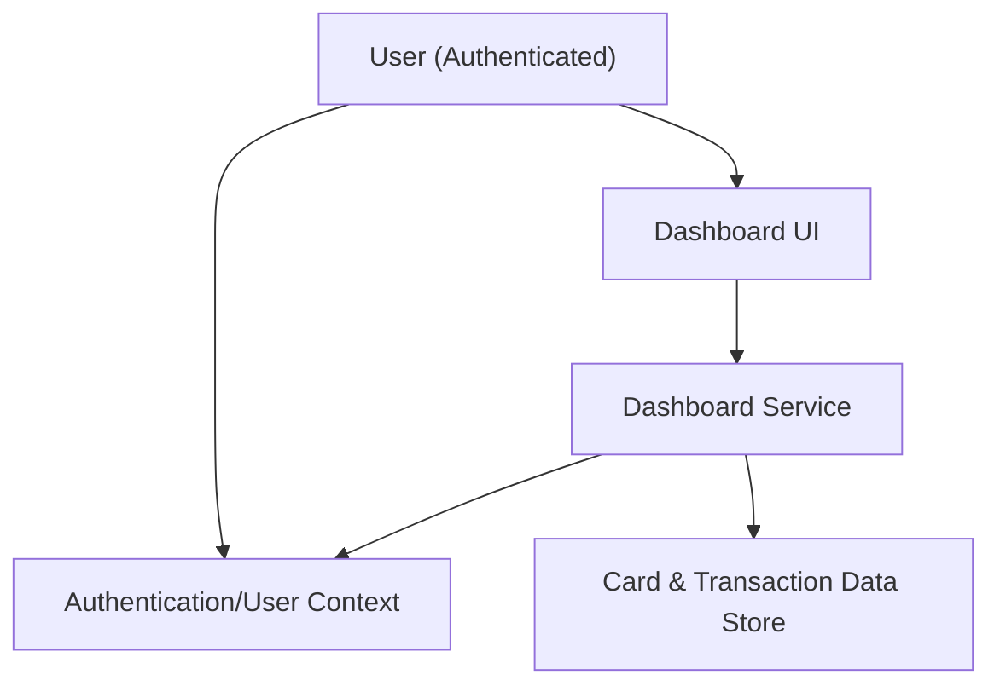

#### 1. High-Level Design
- Summary: Deliver a responsive dashboard that consolidates all credit cards into a single interface, showing key KPIs (monthly spend, total credit limit, available credit, outstanding amounts) with multi-card selection and basic transaction summaries.
- Component Flow:

- Integration Points: Internal card and transaction data sources or mock repositories; authentication/user context service to determine which cards are visible and to scope data.
- Key Assumptions:
  - Card and transaction data is exposed via internal APIs or services with aggregated KPIs readily available or computable in near-real time.
  - Authentication provides a stable user identifier used to fetch card portfolio and associated transactions.
- NFR Highlights: Dashboard views must render with low latency for typical consumer data volumes; UI must be responsive across desktop and mobile; KPIs must be displayed without exposing full card numbers or other sensitive identifiers.

#### 2. Validation Report
- Requirements Coverage: The design covers a unified multi-card dashboard, KPI computation and display, card listing and selection, and basic transaction summaries, aligned with the in-scope features and honoring NFRs and out-of-scope constraints (no real bank/payments integrations).

