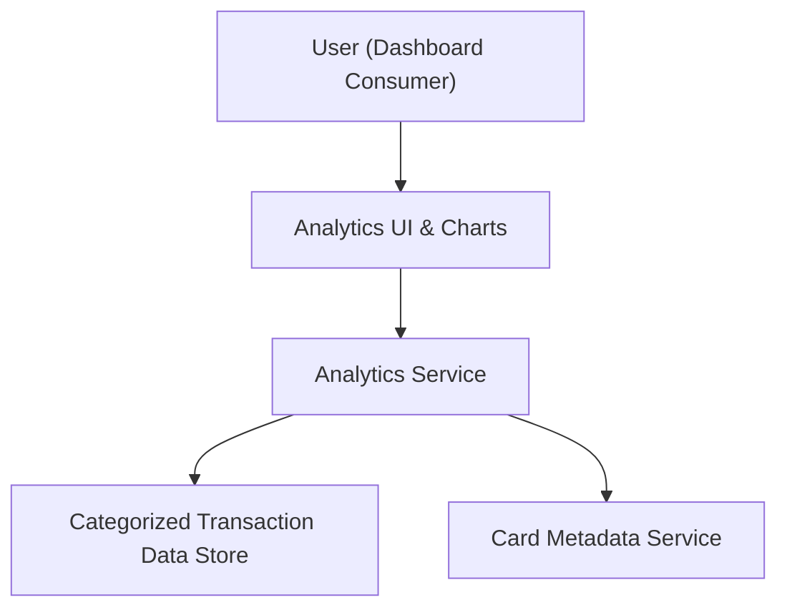

#### 1. High-Level Design
- Summary: Provide interactive analytics for monthly spend trends, card-wise spend analysis, and category-wise spending across defined categories, with filters and drill-downs over selected time periods.
- Component Flow:

- Integration Points: Categorized transaction data source per card (including category, date, amount); internal analytics/aggregation logic or services to compute monthly and category-wise totals; card metadata services for card-wise segmentation.
- Key Assumptions:
  - Transaction data is already tagged with spending categories or can be reliably categorized upstream before analytics processing.
  - Analytics service can access historical transaction data for the selected time ranges without needing external third-party data providers.
- NFR Highlights: Analytics visualizations must load within acceptable time for typical transaction volumes, remain usable on responsive layouts, and compute category aggregations accurately without exposing sensitive transaction details.

#### 2. Validation Report
- Requirements Coverage: The design supports monthly trend charts, card-wise spend analysis, category-wise breakdown, category filters, drill-down interactions, and time-period selection while staying within scope and excluding predictive scoring, budgeting recommendations, and external data enrichment.

