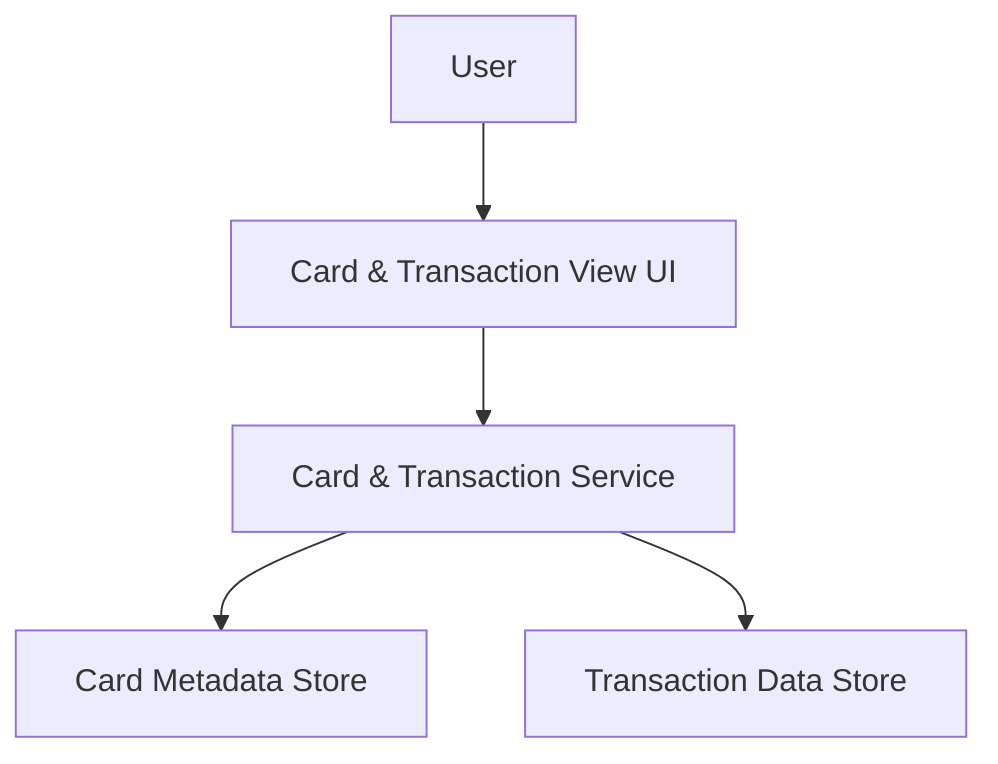

#### 1. High-Level Design
- Summary: Provide structured views of cards and their associated transactions, enabling users to switch between cards, see transaction-level details, and support the KPIs and analytics presented in the dashboard.
- Component Flow:

- Integration Points: Internal transaction data storage or mock transaction feeds; card metadata services to link transactions to the correct card and categories; linkage to dashboard/analytics services that consume these transaction views.
- Key Assumptions:
  - Transaction data includes sufficient metadata (card ID, date, amount, category) to support filters and linkage to dashboard KPIs and analytics without additional enrichment.
  - Pagination or result limiting is handled by the service layer to keep UI performance stable across devices.
- NFR Highlights: Transaction lists must be paginated or limited for responsive performance, avoid exposing sensitive information (e.g., full card numbers, CVV), and handle multiple cards with moderate transaction volumes without degrading user experience.

#### 2. Validation Report
- Requirements Coverage: The design meets the epic’s scope by providing card list and selection, per-card transaction views, categorization for analytics, basic filters, and linkage to KPIs, while respecting NFRs and explicitly excluding real-time bank streaming, disputes, card limit changes, payments, and gateway/loan integrations.

