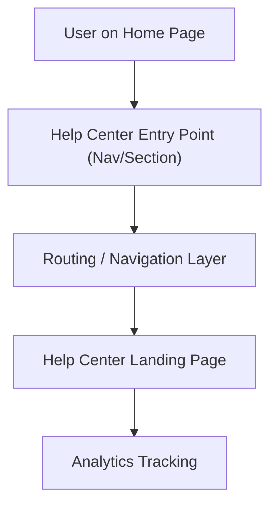

#### 1. High-Level Design
- Summary: Provide a clearly visible Help Center entry point on the Home Page that navigates users to a dedicated Help Center landing page without disrupting existing Home Page layout, performance, or user journeys, while aligning with branding and WCAG 2.1 AA accessibility standards.

- Component Flow:

- Integration Points:
  - Existing website infrastructure and CMS for adding the entry point and navigation.
  - Branding guidelines and design system for visual consistency.
  - Analytics tooling to measure Help Center usage originating from the Home Page.
  - Hosting and deployment pipeline for updated Home Page and Help Center landing page.

- Key Assumptions:
  - Navigation uses existing site routing framework (e.g., existing SPA/router or server-side routing) without introducing a new routing technology.
  - Analytics events for Help Center entry are implemented using the current analytics platform and event schema.

- NFR Highlights:
  - Help Center must load within 2 seconds (broadband) / 4 seconds (mobile), maintain 99.9% uptime, support 100,000 concurrent users, and must not degrade Home Page performance or layout stability while meeting WCAG 2.1 AA accessibility.

#### 2. Validation Report
- Requirements Coverage: The design covers entry point placement, navigation to the Help Center landing page, non-disruptive integration with existing Home Page layout, branding alignment, accessibility compliance, performance constraints, throughput/uptime targets, and analytics integration as described in the epic.

---