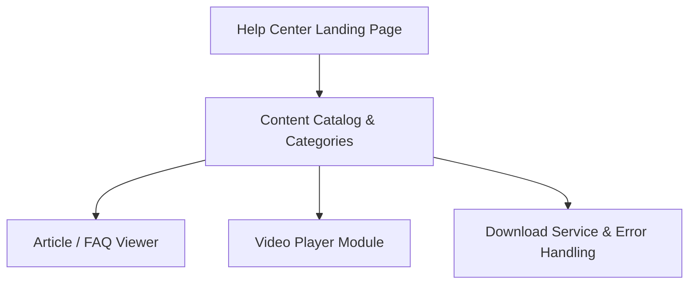

#### 1. High-Level Design
- Summary: Implement a dedicated Help Center landing page that provides categorized, accessible, and performant self-service content (articles, FAQs, videos, downloads) with responsive design and meaningful error handling so users can easily find and consume support materials across devices.

- Component Flow:

- Integration Points:
  - Existing website infrastructure and CMS for storing and rendering help articles and downloadable materials.
  - Video hosting platform for tutorials and embedded playback.
  - Editorial team workflows for content creation, updates, and maintenance.
  - Analytics platform for tracking content usage and performance.
  - Branding and UX guidelines for layout and visual design.

- Key Assumptions:
  - Content metadata (categories, tags, content type) is available in the CMS and can be queried efficiently for category browsing and responsive layouts.
  - Downloadable assets (PDFs, guides) are hosted on existing secure infrastructure with HTTPS already enabled and monitored.

- NFR Highlights:
  - Help Center content and landing page must load within 2 seconds (broadband) / 4 seconds (mobile), video playback must start within 3 seconds, all content must meet WCAG 2.1 AA, support 100,000 concurrent users, serve all downloads securely over HTTPS, and maintain 99.9% uptime with automated fallbacks.

#### 2. Validation Report
- Requirements Coverage: The design addresses the dedicated landing page, logical content categories, text and FAQ viewing, embedded video playback, downloadable materials, responsive UI, meaningful error messaging, branding and accessibility compliance, performance targets, secure delivery of downloads, scalability, and uptime expectations specified in the epic.

---