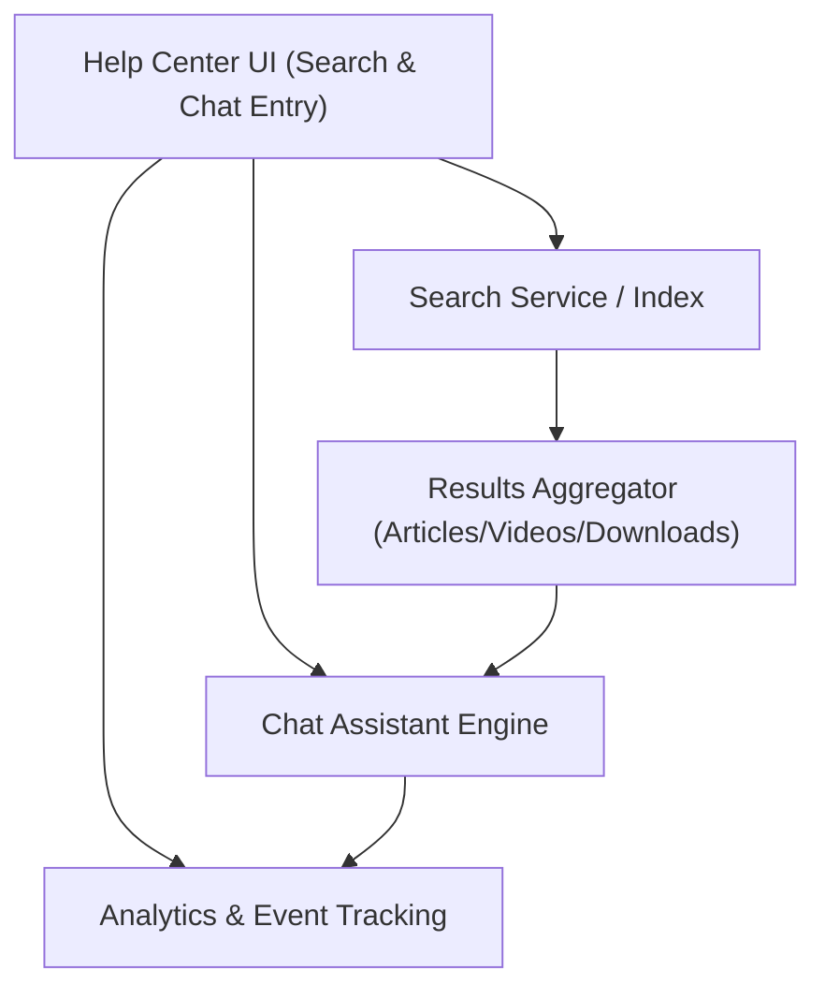

#### 1. High-Level Design
- Summary: Provide keyword search and filtering across Help Center content, an interactive chat assistant that surfaces relevant resources in real time, and analytics tracking of user interactions and chat behavior to improve content while meeting performance, scalability, and security constraints.

- Component Flow:

- Integration Points:
  - Search service or capability integrated with the Help Center content index.
  - Chat assistant technology and underlying platform.
  - Existing website infrastructure and CMS for content retrieval (articles, videos, downloads).
  - Analytics and reporting tools capturing search, navigation, and chat events.
  - Editorial and support teams maintaining the chat knowledge base and interpreting analytics outputs.

- Key Assumptions:
  - Search index is periodically synchronized with CMS content so all Help Center resources are searchable by keyword and category/content type filters.
  - Chat assistant is configured as an authenticated, HTTPS-only service using existing identity/session context and does not persist sensitive user data beyond what is required for support.

- NFR Highlights:
  - Search results must be returned within ~2 seconds, chat must open within 2 seconds and support up to 10,000 simultaneous sessions, all chat over HTTPS without exposing sensitive data, analytics capture must not degrade Help Center performance, and overall scalability must support 100,000 concurrent users.

#### 2. Validation Report
- Requirements Coverage: The design fulfills keyword search across all Help Center content, results including articles/videos/downloads with filtering, interactive chat assistant with links to relevant content, analytics tracking of interactions and chat sessions, support staff visibility into chat behavior, and the required performance, scalability, security, and non-degradation constraints outlined in the epic.

---