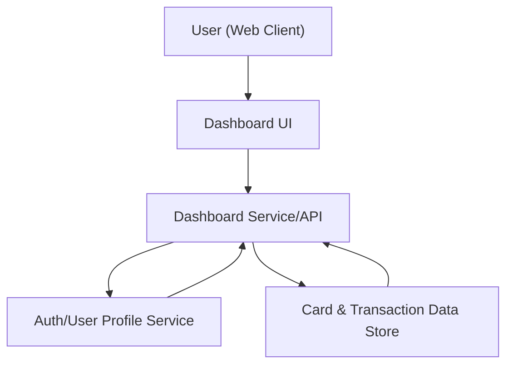

#### 1. High-Level Design
- Summary: Deliver a consolidated, responsive dashboard that presents key credit card metrics (monthly spend, total credit limit, available credit, outstanding amounts) across all cards in a single interface for rapid understanding of overall credit exposure and spending status.
- Component Flow:

- Integration Points: Internal card & transaction data store (for card details, limits, balances, transactions); authentication/user profile service to identify and fetch the user’s cards (if implemented).
- Key Assumptions:
  - Card and transaction data is exposed via an internal API or data access layer with pre-aggregated or easily aggregatable metrics.
  - User identity and card-to-user mapping are available from the authentication/user profile service when multi-user is enabled.
- NFR Highlights: Dashboard KPIs must render with minimal latency for typical consumer datasets; UI must be responsive across desktop, tablet, and mobile, with accurate and consistent calculations for spend and limits.

#### 2. Validation Report
- Requirements Coverage: The design supports a unified multi-card dashboard, KPI visualizations for spend, limits, available credit, and outstanding amounts, and a responsive UI backed by internal data and authentication/profile services, aligning with the epic’s stated scope and NFRs.
