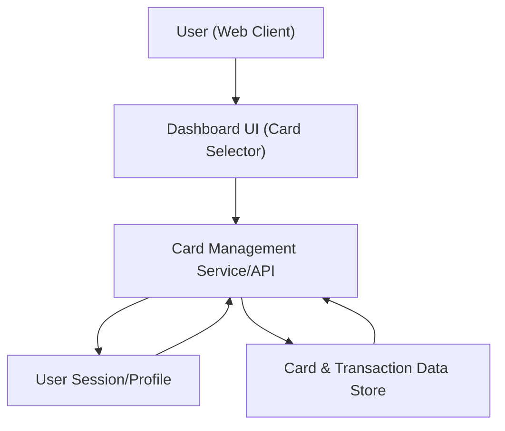

#### 1. High-Level Design
- Summary: Provide card-specific management and visualization within the dashboard, including card-wise views, KPI breakdowns (spend, limit, available credit, outstanding), basic transaction listings, and UI mechanisms to switch or filter between cards.
- Component Flow:

- Integration Points: Internal card and transaction data repository or mock data structures; user session or profile mechanism to associate and filter cards for the current user.
- Key Assumptions:
  - Each card and associated transactions are tagged by user/profile ID to enforce correct scoping and prevent cross-user data exposure.
  - Transaction summaries and KPIs are computed by the Card Management Service/API layer using data from the repository.
- NFR Highlights: System must handle multiple cards per user without noticeable degradation in dashboard responsiveness; card-wise calculations must be accurate from transaction data; data handling must prevent exposure of card data between different users.

#### 2. Validation Report
- Requirements Coverage: The design enables representation of multiple cards, card-wise KPI views, per-card transaction summaries, and card switching/filtering in the UI, while leveraging user session/profile and internal data repositories to meet the epic’s scope and non-functional constraints on responsiveness, accuracy, and data isolation.
