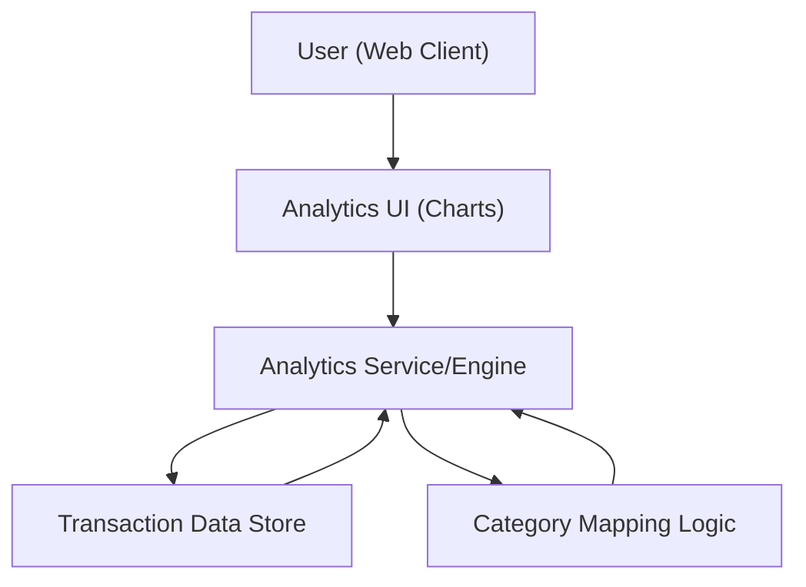

#### 1. High-Level Design
- Summary: Implement interactive spend analytics with monthly trend visualizations and category-wise spending insights across standard categories, enabling users to understand spending patterns and adjust behavior.
- Component Flow:

- Integration Points: Transaction data store containing transactions with categories or mappable descriptors; internal analytics layer or computation engine for aggregation by month and category.
- Key Assumptions:
  - Transactions either store explicit category codes or can be deterministically mapped via descriptors using the Category Mapping Logic.
  - Analytics results (monthly trends, category breakdowns) are computed server-side and returned in a format easily consumable by the analytics UI components.
- NFR Highlights: Analytics visualizations must load within acceptable UI performance thresholds for typical transaction volumes; category aggregation logic must be accurate and deterministic; visual components must remain usable and readable across responsive layouts.

#### 2. Validation Report
- Requirements Coverage: The design covers monthly spend trend charts, category-wise visualizations across defined categories, interactive filtering across cards/time ranges, and deterministic aggregation of transactions into monthly and category buckets, meeting the epic’s functional scope and performance/accuracy-related NFRs.
