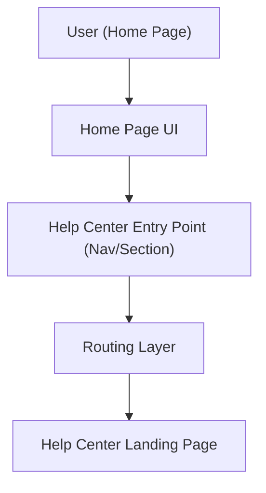

#### 1. High-Level Design

- Summary: Introduce a clearly visible Help Center entry point on the Home Page that routes users to the dedicated Help Center landing page without disrupting existing Home Page functionality, enabling quick discovery of self-service support.

- Component Flow:

- Integration Points:
  - Existing website infrastructure and CMS (for Home Page and Help Center hosting)
  - Branding and design system for Home Page components
  - Analytics tooling for usage tracking of the Help Center entry point

- Key Assumptions:
  - Help Center landing page URL/endpoints are already provisioned or will be provided by the Help Center feature team.
  - Existing analytics framework (e.g., tag manager) is reused for tracking entry point clicks without introducing a new analytics platform.

- NFR Highlights: Help Center entry must load the landing page within 2–4 seconds, run over HTTPS, meet WCAG 2.1 AA accessibility, and support up to 100,000 concurrent users with 99.9% availability.

#### 2. Validation Report

- Requirements Coverage: The design covers placement of a prominent Home Page entry point, routing behavior, non-disruptive integration with current layout, branding compliance, analytics tracking, and alignment with the stated performance, availability, security, and accessibility constraints.
