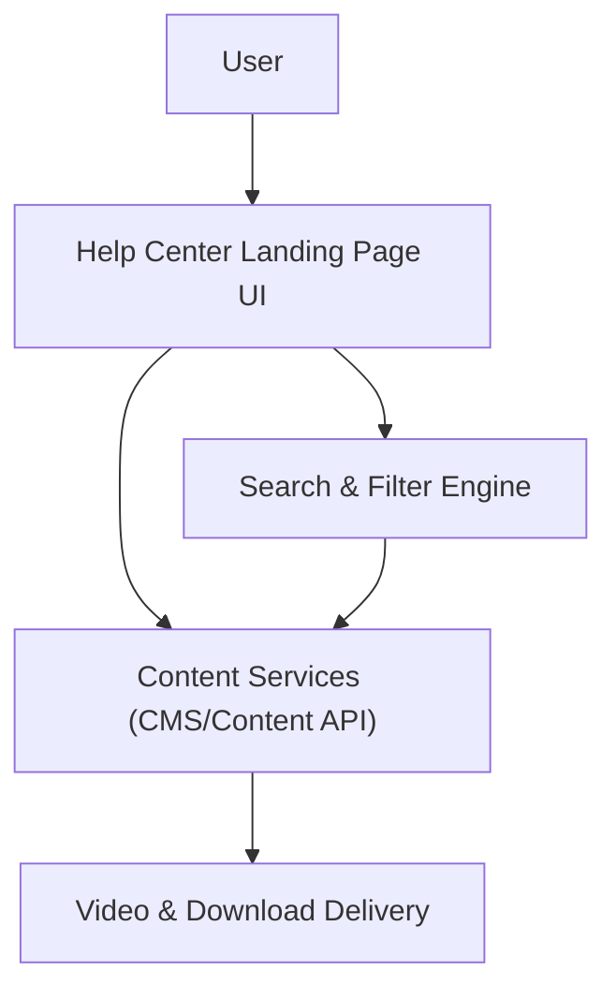

#### 1. High-Level Design

- Summary: Deliver a dedicated Help Center landing page that organizes support resources into logical categories and multiple content types (articles, FAQs, videos, downloads), with search, filtering, responsive design, error handling, branding, and accessibility to enable effective self-service onboarding and troubleshooting.

- Component Flow:

- Integration Points:
  - Existing website infrastructure and CMS for hosting and managing help content
  - Video hosting platform for embedded tutorials
  - Analytics tools for measuring Help Center usage and self-service success metrics

- Key Assumptions:
  - CMS exposes content (articles, FAQs, videos, files) via APIs or standard templates that the Help Center UI can consume without changes to backend authoring workflows.
  - Search and filtering leverage existing or standard indexing capabilities rather than requiring a new bespoke search engine.

- NFR Highlights: Help Center content must load within 2–4 seconds (page, articles), videos must start within 3 seconds, downloads must begin within 2 seconds over HTTPS, all features must meet WCAG 2.1 AA, support 99.9% uptime and up to 100,000 concurrent users.

#### 2. Validation Report

- Requirements Coverage: The design addresses a dedicated landing page, logical categorization, multi-format content (text, FAQs, video, downloadable materials), keyword search, category/content-type filters, error handling for unavailable resources, responsive behavior across devices, branding and accessibility compliance, and optional feedback, personalization, and bookmarking within the defined scope and NFRs.
