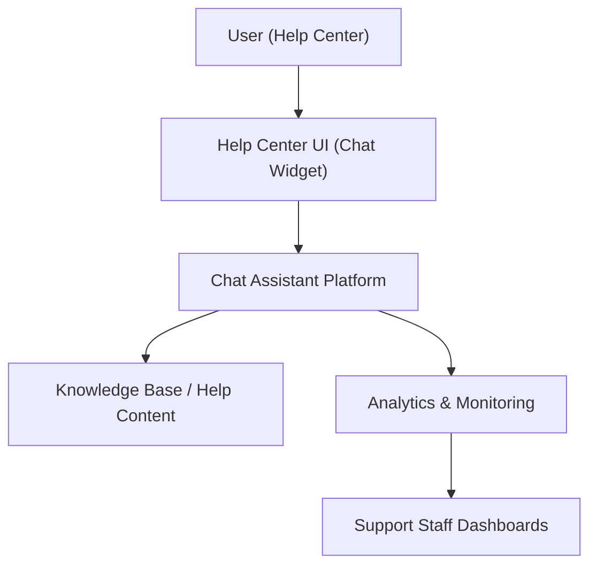

#### 1. High-Level Design

- Summary: Provide an integrated interactive chat assistant within the Help Center that offers automated real-time support, surfaces relevant help resources based on user queries, tracks interactions for analytics, and enables support staff monitoring, while ensuring secure, scalable, and accessible chat experiences.

- Component Flow:

- Integration Points:
  - Chat assistant technology platform embedded into the existing Help Center UI
  - Existing website infrastructure for rendering and hosting the chat component
  - Analytics tools to capture chat interactions, performance, and insights for content improvement
  - Editorial and support teams for maintaining the chat knowledge base and tuning responses

- Key Assumptions:
  - The selected chat platform supports HTTPS, WCAG 2.1 AA, and exposes APIs or configuration for knowledge base integration and analytics export.
  - Chat monitoring for support staff is provided via the platform’s native dashboards or existing analytics tooling without custom data pipelines.

- NFR Highlights: Chat must support up to 10,000 simultaneous chat sessions within the 100,000 concurrent user capacity, open within 2 seconds from the Help Center, operate over HTTPS without exposing sensitive data, maintain 99.9% uptime, and comply with WCAG 2.1 AA accessibility standards.

#### 2. Validation Report

- Requirements Coverage: The design covers an interactive chat assistant accessible from the Help Center, automated responses, chat-driven linking to relevant content, monitoring of interactions by support staff, analytics tracking, optional personalization and bookmarking, error handling for chat unavailability, and adherence to specified scalability, security, performance, reliability, and accessibility constraints.
