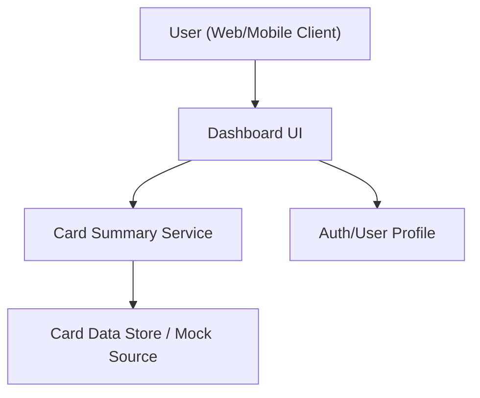

#### 1. High-Level Design
- Summary: Deliver a modern, responsive dashboard that consolidates key KPIs across all user credit cards (monthly spend, total credit limit, available credit, outstanding amounts) to provide a unified view of overall credit position.
- Component Flow:

- Integration Points: Internal data sources or mock services providing card limits, balances, and spend summaries; user/auth/profile service for identifying the user’s cards.
- Key Assumptions:
  - Card KPI data (limits, balances, monthly spend) is pre-aggregated per card and exposed via internal APIs or mock services.
  - Authentication and user profiling are handled by an existing identity layer, and this epic consumes those services.
- NFR Highlights: Must support typical multi-card consumer usage with no noticeable latency; dashboards should render within acceptable response times on standard web and mobile devices; must avoid exposing sensitive card data such as full card numbers or CVV.

#### 2. Validation Report
- Requirements Coverage: The design includes a responsive dashboard UI, multi-card view, and KPI aggregation via internal services, covering the epic’s scope (monthly spend, total credit limit, available credit, outstanding amounts, and basic card listing/selection) while adhering to the stated NFRs and in-scope/out-of-scope boundaries.

---
