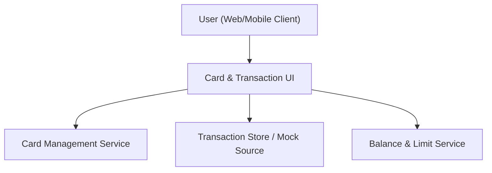

#### 1. High-Level Design
- Summary: Enable users to manage and view multiple credit cards and their associated transactions within a single dashboard, supporting card-wise transaction lists, card selection/switching, and display of card-specific outstanding amounts and available credit.
- Component Flow:

- Integration Points: Internal transaction store or mock transaction source providing per-card transaction data; internal services providing card-level balance and limit details.
- Key Assumptions:
  - Transaction data is already stored or simulated in an internal transaction store and can be queried by card identifier and date range.
  - Card balance/limit data services are consistent with those used by the dashboard KPI epic, allowing reuse of APIs for outstanding and available credit.
- NFR Highlights: System must handle typical consumer transaction volumes with reasonable loading times; views must protect PII and sensitive payment data; interface must remain usable and consistent across common desktop and mobile resolutions.

#### 2. Validation Report
- Requirements Coverage: The design introduces UI for multi-card selection, card-wise transaction lists, and integration with internal transaction and balance/limit services, adequately covering support for multiple cards per user, transaction views, card switching, and card-specific outstanding/available credit as defined in the epic and aligned with its NFRs.

---
