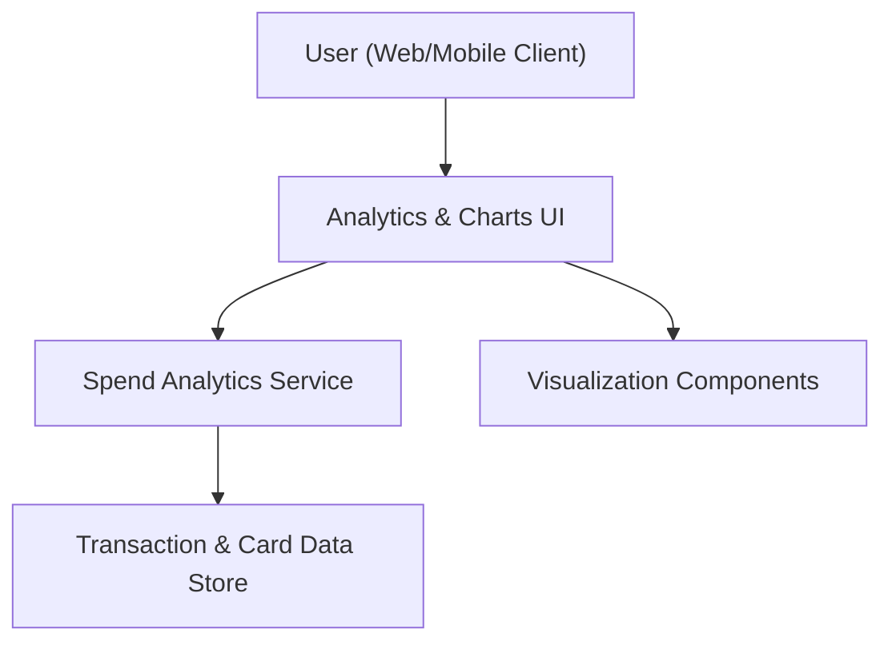

#### 1. High-Level Design
- Summary: Provide interactive analytics and visualizations within the dashboard to show monthly spend trends, card-wise spend analysis, and category-wise breakdowns (e.g., Food & Dining, Fuel, Shopping, Travel, Entertainment, Utilities, Healthcare, Education, Miscellaneous), helping users understand and optimize spending behavior.
- Component Flow:

- Integration Points: Internal analytics or aggregation logic operating over transaction and card data; visualization components for charts and graphs; reuse of transaction and card data services from the transaction visibility and KPI epics.
- Key Assumptions:
  - Analytics service performs aggregation (monthly, per card, per category) on existing transaction data and exposes summarized data via APIs.
  - Visualization components are standard charting libraries compatible with the existing dashboard frontend.
- NFR Highlights: Analytics visualizations must render efficiently for typical data volumes without degrading UX; charts and summaries must avoid exposing sensitive transaction details; the dashboard should remain responsive when users switch cards or time periods for analytics.

#### 2. Validation Report
- Requirements Coverage: The design incorporates an analytics service, data store access, and chart visualization components embedded in the main dashboard, covering monthly trends, card-wise spend analysis, category-wise breakdown, and interactive visuals, while respecting the specified NFRs and leveraging the defined internal integrations.
