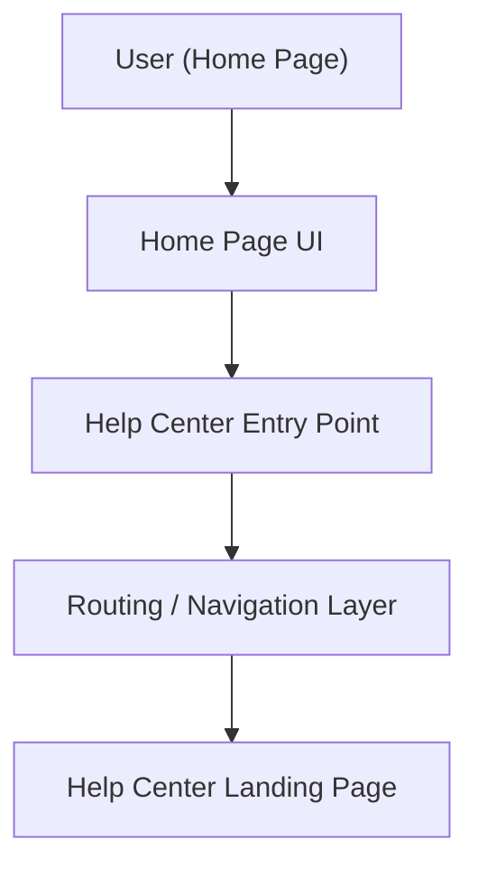

#### 1. High-Level Design
- Summary: Provide a clearly visible, accessible Help Center entry point on the Home Page that navigates users to a dedicated Help Center landing page without changing existing Home Page behavior or layout, while adhering to branding and accessibility standards.
- Component Flow:

- Integration Points:
  - Existing website infrastructure and CMS for hosting the Home Page and routing to the Help Center.
  - Branding and design system for styling the Help Center entry point.
  - Analytics tools for tracking Help Center usage and impact on support tickets.
- Key Assumptions:
  - Help Center landing page already exists and is reachable via internal routing from the Home Page.
  - Analytics events for Help Center entry can be implemented using the existing analytics tooling and event schema.
- NFR Highlights: HTTPS-only interactions, WCAG 2.1 AA accessibility, Help Center landing page open ≤2 seconds (≤4 seconds mobile), support for up to 100,000 concurrent users without degrading Home Page behavior, 99.9% availability.

#### 2. Validation Report
- Requirements Coverage: The design covers the Home Page entry point placement, routing to the Help Center landing page, use of existing branding and accessibility standards, and preserves current Home Page functionality while enabling analytics tracking of usage.
