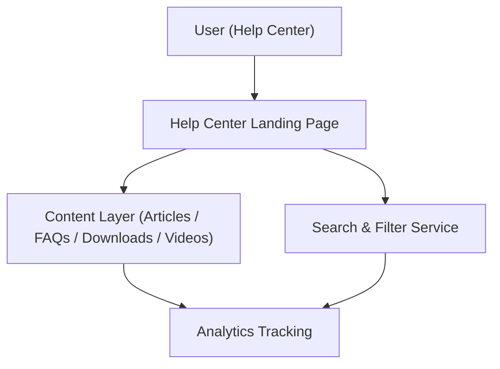

#### 1. High-Level Design
- Summary: Implement a dedicated Help Center landing page offering categorized content (articles, FAQs, downloads, videos) with integrated search, filtering, error handling, analytics, and optional feedback/personalization, all meeting performance, security, scalability, and accessibility requirements.
- Component Flow:

- Integration Points:
  - Existing website infrastructure and CMS for hosting articles and documents.
  - Video hosting platform for embedded tutorials.
  - Analytics platform for Help Center usage and self-service resolution metrics.
  - Editorial team processes and tools for content creation, maintenance, and updates.
- Key Assumptions:
  - Search and filtering operate over a unified content index built from the existing CMS and video platform.
  - Error handling for unavailable resources uses the existing site-wide error messaging framework extended with Help Center-specific messages.
- NFR Highlights: Content and landing page load ≤2 seconds (≤4 seconds mobile), video player start ≤3 seconds, all content over HTTPS, scale to 100,000 concurrent users and 10,000 simultaneous interactions, WCAG 2.1 AA accessibility, 99.9% uptime with robust error handling.

#### 2. Validation Report
- Requirements Coverage: The design addresses categorized landing page content, multi-format support (text, FAQs, downloads, videos), unified search and filtering, error handling, analytics tracking, and optional feedback/personalization, while satisfying the specified performance, security, scalability, accessibility, and reliability constraints.
