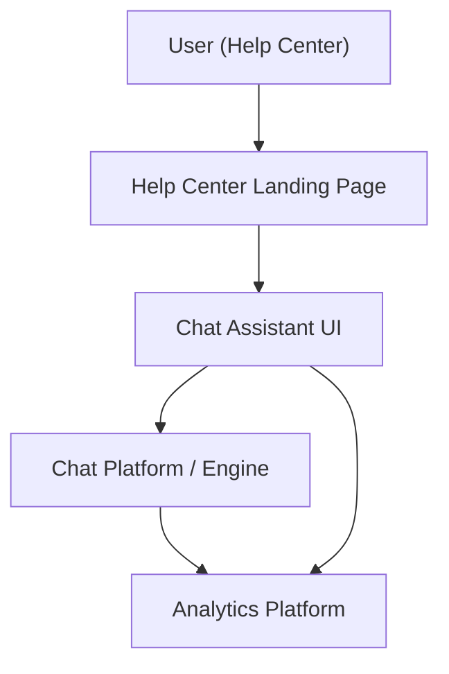

#### 1. High-Level Design
- Summary: Deliver an interactive, automated chat assistant in the Help Center that provides real-time support, links to relevant content, supports monitoring by staff, and feeds detailed analytics for continuous improvement, while conforming to security, scalability, accessibility, and branding requirements.
- Component Flow:

- Integration Points:
  - Chat assistant technology platform integrated into the Help Center.
  - Existing website infrastructure and CMS for linking articles, videos, and downloads via chat.
  - Analytics platform for tracking chat sessions, outcomes, and impact on ticket volumes.
  - Editorial and support teams for maintaining the chat knowledge base and monitoring interactions.
- Key Assumptions:
  - The chat knowledge base reuses existing Help Center content metadata and URLs maintained by editorial/support teams.
  - Monitoring dashboards for chat analytics are implemented using existing analytics and reporting tools rather than new bespoke systems.
- NFR Highlights: Chat window open ≤2 seconds from Help Center landing page, HTTPS-secured interactions with no sensitive data exposure, support for up to 10,000 simultaneous chat sessions, WCAG 2.1 AA accessibility for chat, 99.9% uptime with graceful degradation and fallback suggestions when chat is unavailable.

#### 2. Validation Report
- Requirements Coverage: The design covers chat assistant access from the Help Center landing page, automated responses based on a configured knowledge base, linking to articles/videos/downloads, monitoring of interactions, analytics tracking for continuous improvement, and compliance with branding, accessibility, security, scalability, and reliability requirements.
